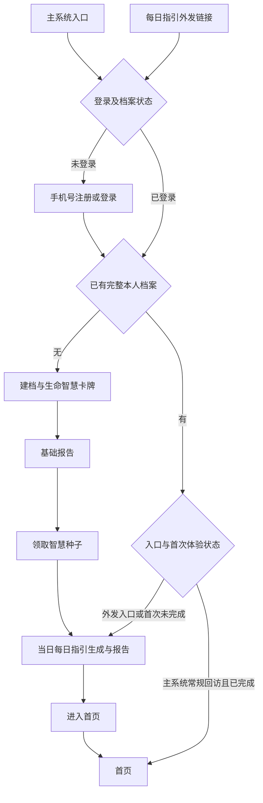

# 每日指引首次体验与独立引流

需求：WFH11-06。

## 1. 已确认目标

当前用户描述的流程：手机号注册 → 创建生命智慧卡牌 → 基础报告 → 领取智慧种子 → 首页 → 主动进入每日指引。

目标流程：手机号注册 → 创建生命智慧卡牌 → 基础报告 → 领取智慧种子 → 每日指引报告 → 首页。

“每日指引单独交付”指可独立传播的入口加上共用的用户流程，不是新增独立账号系统或复制一套每日指引计算。主系统入口与外发链接进入同一注册、建档及报告流程，新用户都会在进入首页前先体验每日指引。

## 2. 目标主流程

新注册主路径为已确认要求；已有账号、重入、异常和首次体验完成定义是下述设计建议，需评审冻结。此图不代表新增页面数量：优先复用现有注册、建档、基础报告、种子和每日指引页面。

## 3. 用户状态与入口路由

| 状态 | 主系统入口 | 每日指引外发链接 |
| --- | --- | --- |
| 未登录 | 完成登录后按账号真实状态继续 | 保存入口来源，登录后继续指引流程 |
| 已登录、未完成建档 | 恢复最近有效步骤，完成基础报告/种子后进入指引 | 同左，不另建档案 |
| 新注册、建档完成、首次指引未完成 | 进入或恢复每日指引 | 进入或恢复同一每日指引 |
| 已完成首次体验、当天已有报告 | 常规进入首页 | 直接查看本人的当日报告，再可进入首页 |
| 已完成首次体验、当天无报告 | 常规进入首页，保留既有指引入口 | 按现有权益规则启动当天指引 |
| 老用户升级版本 | 建议不强制重走首次注册流程 | 使用已有本人档案体验当日指引 |

外发链接只能让接收者生成/查看自己的指引，不携带发送者的出生资料或私密报告。来源标识可用于转化统计，不能改变账号归属；重复进入不能创建重复账号、本人档案或重复领取注册种子。

## 4. 首次体验与完成状态

草案建议以“报告已成功展示，用户点击进入首页”为首次体验完成事件；不以提交生成请求当作已完成，不强制停留若干秒或逐段滚动。

用户完成后，日常主系统登录不再每天被强制拦截到每日指引。页面刷新、返回、换设备及登录中断应从服务端已确认状态恢复，不能只依赖浏览器本地标记。业务要区分“新用户首次体验完成”和“今天是否有报告”，两者不是同一状态。

正常新用户路径先阅读每日指引再进入首页。生成失败是否提供“稍后再看，先进入首页”属于关键待决策；草案建议提供，记录为暂缓而非阅读完成，首页保留继续入口，避免故障长期锁住整个产品。

## 5. 报告复用与日期

首次入口和首页指引复用同一账号、档案、报告、任务和权益记录。同一份已交付当日报告重复打开不会重新扣费。具体幂等维度沿用现有后端契约；用户档案变化或跨日时，按报告实际日期和档案版本处理，不能覆盖历史事实。

跨日恢复时明确区分“昨日已开始/已生成报告”和“今日新报告”：恢复昨日任务显示原日期；主动请求今日内容才进入今日生成与权益判断，不能把旧报告冒充今日。首次体验跨日后是否要求再读今日报告，草案建议不重复强制，需随首次完成规则冻结。

## 6. 智慧种子与权益：必须冻结的商业规则

本次要求保留“领智慧种子”后体验每日指引，但未指定体验免费、消耗赠送种子还是专用权益。现有集成文档包含种子预占/核销/释放，因此不能把入口前置直接解释为免费，也不能擅自设置扣费数额。

进入实现前确定：新用户首次报告的权益来源、消耗规则、保障额度、老用户通过外发链接的规则，以及余额不足时返回路径。首次引流应能完成体验是产品目标；是否用专用首次权益或足额赠送种子实现，由产品确认。

如会扣减，应在生成前明示资源消耗；重复点击、失败重试和多端进入不得重复扣减。新用户缺少体验权益时提供可恢复的说明，不能在没有产品决策的情况下直接新增强制购买步骤。

## 7. 异常与恢复

| 场景 | 预期体验 |
| --- | --- |
| 注册/登录中断 | 恢复合法来源和既有账号状态，不要求重复建档 |
| 基础报告或领种子中断 | 沿用各步骤真实状态继续，不重复领种子或跳过必需条件 |
| 生成中刷新、关闭、重复点击 | 恢复同一任务，显示真实状态，不创建并行重复任务 |
| 生成失败或超时 | 保留资料，提示可重试；权益按既有失败释放规则处理 |
| 登录过期 | 登录后恢复本人任务；不得展示上一个账号内容 |
| 配置加载失败 | 不影响已完成报告读取；新请求校验可用性 |
| 首页菜单改名或排序 | “进入首页”按固定目标标识落点，不按文案匹配 |

## 8. 内容、统计与验收

指引报告使用本版小岁 IP、短介绍及对应五福模板。首页摘要与详情引用同一报告事实。

沿用现有埋点体系补充入口来源、首次流程进入、指引任务成功/失败、报告打开、进入首页、异常暂缓；记录稳定业务 ID 和版本，不记录手机号、完整出生资料、报告正文。按主系统/外发入口分别观察漏斗；事件名称及去重口径在接口设计时冻结。

验收至少包含两条新用户全流程、老用户外链复用、未完成用户恢复、跨日、生成失败、余额不足、多端重复进入和导航改名。不能只验证已登录已有报告用户的链接打开。
