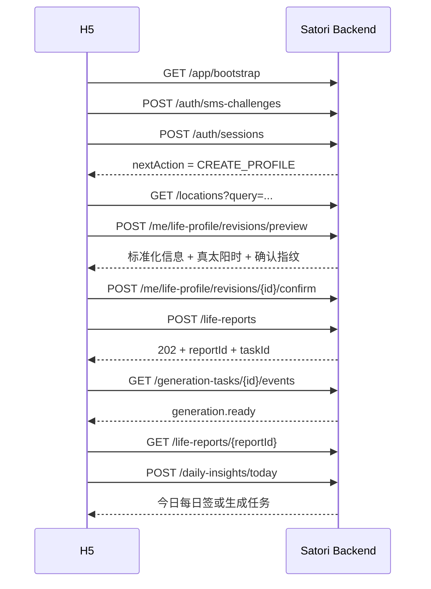
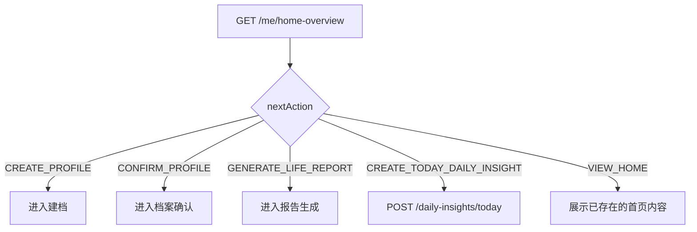

# Satori R1：H5 与 Satori 后端接口文档

> 文档状态：接口讨论稿 v1.0  
> API 版本：`v1`  
> 适用范围：Satori 单品牌 C 端产品 R1  
> 依赖文档：[R1 系统架构方案](../architecture/R1-系统架构方案.md)  
> 更新日期：2026-08-09

## 1. 文档目的

本文档定义 Satori H5 与 Satori Backend 之间的 HTTP API 契约，覆盖：

- 应用初始化和协议文档；
- 手机验证码登录和 Session；
- 当前用户及偏好设置；
- 出生地点搜索；
- 本人人生档案预计算、确认和历史版本；
- 人生报告异步生成、查询和历史记录；
- 每日签按需生成和历史查询；
- 产品权益查询；
- 用户反馈；
- 账号注销入口；
- SSE 任务进度；
- 通用鉴权、幂等、分页和错误规范。

本文档是人类可读的接口设计基线。确认后应据此生成 OpenAPI 3.1 文件，并在 H5 与 Backend CI 中执行契约校验。

本文档不定义：

- Admin API；
- Satori Backend 与 Aqua AI 的内部协议；
- 数据库表结构；
- 页面路由与 UI 组件；
- 报告最终章节文案；
- 支付、卡牌和关系报告接口。

---

## 2. API 设计原则

### 2.1 稳定资源优先

接口围绕 User、LifeProfileRevision、LifeReport、GenerationTask、DailyInsight、Entitlement 和 Feedback 设计，不直接按某个页面的组件结构设计。

### 2.2 命令与查询分离

- `GET` 只读取数据，不触发 AI 生成或修改状态；
- 创建、确认、生成、重试等命令使用 `POST`；
- 可重复设置的用户偏好使用 `PATCH`；
- 注销当前 Session 或撤销申请使用 `DELETE`。

### 2.3 H5 不感知 Aqua AI

H5 只看到产品化任务状态和阶段，不接收 Aqua run ID、模型、Prompt、Token 或知识库等内部信息。

### 2.4 对外隐藏内部领域复杂度

后端内部可以有 Report、ReportRevision、Outbox 和 AIContextGrant。H5 侧将一次正式报告版本统一视为一个 `LifeReport` 资源。

### 2.5 异步生成

人生报告和每日签生成均不占用一个长期 HTTP 请求：

- 创建命令返回 `202 Accepted`；
- H5 通过 Task 查询或 SSE 获得进度；
- SSE 断开不影响后台任务；
- H5 可随时重新查询任务和最终资源。

---

## 3. 基础约定

### 3.1 Base URL

```text
Production: https://api.satori.example.com/api/v1
Staging:    https://api.staging.satori.example.com/api/v1
```

实际域名由部署环境决定，路径版本固定为 `/api/v1`。

### 3.2 协议与数据格式

- 仅使用 HTTPS；
- 请求和响应编码为 UTF-8；
- JSON 请求使用 `Content-Type: application/json`；
- JSON 响应使用 `application/json`；
- SSE 响应使用 `text/event-stream`；
- 字段名使用 `camelCase`；
- 枚举值使用 `UPPER_SNAKE_CASE`；
- 资源 ID 使用不透明字符串，H5 不解析 ID 内容。

### 3.3 时间和日期

- 时间点统一返回 RFC 3339 UTC，例如 `2026-08-09T12:30:00Z`；
- 本地日期使用 `YYYY-MM-DD`，例如 `2026-08-09`；
- 时区使用 IANA 名称，例如 `Asia/Shanghai`；
- H5 不根据 UTC 时间自行推导每日签日期，以后端返回的 `localDate` 为准。

### 3.4 通用请求头

| Header | 必需 | 说明 |
| --- | --- | --- |
| `Authorization: Bearer <accessToken>` | 鉴权接口必需 | Access Token |
| `X-Request-Id` | 可选 | 客户端生成的请求标识；不传则由服务端生成 |
| `Idempotency-Key` | 命令接口按要求必需 | 防止重复创建或重复消费 |
| `Accept-Language` | 可选 | R1 默认 `zh-CN` |
| `X-App-Version` | 推荐 | H5 发布版本 |
| `X-Device-Id` | 推荐 | H5 生成的匿名设备标识，不使用硬件唯一标识 |

### 3.5 通用响应头

| Header | 说明 |
| --- | --- |
| `X-Request-Id` | 服务端请求标识，用于排查问题 |
| `X-RateLimit-Limit` | 当前限流窗口上限；适用时返回 |
| `X-RateLimit-Remaining` | 当前窗口剩余额度；适用时返回 |
| `Retry-After` | 被限流或服务暂不可用时建议等待秒数 |

---

## 4. 通用响应结构

### 4.1 成功响应

单个资源：

```json
{
  "data": {
    "id": "resource_01..."
  }
}
```

列表资源：

```json
{
  "data": [],
  "meta": {
    "nextCursor": null,
    "hasMore": false
  }
}
```

`204 No Content` 不返回 Body。

### 4.2 错误响应

```json
{
  "error": {
    "code": "PROFILE_NOT_CONFIRMED",
    "message": "请先确认出生档案",
    "requestId": "req_01...",
    "details": {
      "profileState": "CALCULATED"
    }
  }
}
```

规则：

- `code` 是 H5 判断逻辑的稳定依据；
- `message` 是可展示的默认中文信息，但 H5 可以根据 `code` 替换文案；
- `details` 可选，仅返回安全、结构化的修正信息；
- 不返回堆栈、SQL、模型错误或第三方供应商原始错误；
- H5 应记录 `requestId`，便于客服排查。

### 4.3 HTTP 状态码

| 状态码 | 使用场景 |
| --- | --- |
| `200 OK` | 查询或同步命令成功 |
| `201 Created` | 同步创建资源成功 |
| `202 Accepted` | 异步任务已接受 |
| `204 No Content` | 删除、退出等成功且无返回体 |
| `400 Bad Request` | JSON、参数格式或 Header 错误 |
| `401 Unauthorized` | 未登录、Token 无效或 Session 失效 |
| `403 Forbidden` | 已登录但无权访问资源 |
| `404 Not Found` | 资源不存在或不属于当前用户 |
| `409 Conflict` | 状态冲突、重复确认、正在生成 |
| `422 Unprocessable Entity` | 业务数据无法计算或字段组合不合法 |
| `429 Too Many Requests` | 验证码、登录、生成等被限流 |
| `503 Service Unavailable` | 必要依赖暂不可用 |

为了避免资源枚举，访问他人的用户资源统一返回 `404`，不返回 `403`。

---

## 5. 鉴权与 Session

### 5.1 Token 模型

R1 推荐：

- Access Token：短有效期，登录响应返回，H5 仅保存在内存；
- Refresh Token：由 Backend 写入 `HttpOnly + Secure + SameSite=Lax` Cookie；
- Refresh Token 不出现在 JSON、URL 和前端日志中；
- H5 和 API 应部署在同一站点域名体系下；
- 跨子域请求需要显式允许凭证 Cookie，CORS 不得使用通配来源；
- 刷新成功时轮换 Refresh Token；
- 检测到已轮换 Token 被再次使用时，吊销对应 Session。

Access Token 调用方式：

```http
Authorization: Bearer eyJ...
```

### 5.2 Session 过期处理

1. API 返回 `401 ACCESS_TOKEN_EXPIRED`；
2. H5 只允许一个并发刷新请求；
3. 调用刷新 Session 接口；
4. 成功后重放原请求一次；
5. 刷新失败则清理本地登录态并进入登录页。

H5 不得对非幂等命令进行无限自动重放；带 `Idempotency-Key` 的命令最多自动重放一次。

当 `requiresConsent=true` 时，Session 仍可用于调用 `/me`、`/me/consents`、协议查询和退出接口；其他业务接口返回 `409 CONSENT_REQUIRED`。

---

## 6. 幂等、并发与分页

### 6.1 Idempotency-Key

以下接口必须携带 `Idempotency-Key`：

- 创建短信 Challenge；
- 手机验证码登录；
- 创建档案预计算版本；
- 确认档案版本；
- 发起人生报告；
- 重试生成任务；
- 创建或获取今日每日签；
- 提交反馈；
- 接受最新协议；
- 创建账号注销申请。

建议格式为 UUID v4。相同用户、相同接口、相同 Key：

- 请求体一致：返回第一次请求的相同业务结果；
- 请求体不一致：返回 `409 IDEMPOTENCY_KEY_REUSED`；
- Key 的服务端保留期为可配置项，不能短于相关任务的最大重试窗口。

### 6.2 并发控制

- 档案版本是不可变资源，不提供覆盖式更新；
- 同一个 Preview Revision 只能确认一次；
- 同一用户同一档案版本只允许一个活动中的人生报告生成任务；
- 同一用户同一生活时区日期只允许一个正式 DailyInsight；
- 唯一约束由数据库保证，不能只依赖 Redis 锁。

### 6.3 Cursor 分页

列表接口统一支持：

```text
?limit=20&cursor=opaque_cursor
```

- `limit` 默认 20，最大 50；
- `cursor` 为服务端不透明值；
- 列表默认按 `createdAt DESC, id DESC`；
- H5 不解析或持久修改 cursor。

---

## 7. 接口总览

### 7.1 公共与登录

| Method | Path | 说明 | 鉴权 |
| --- | --- | --- | --- |
| `GET` | `/app/bootstrap` | 获取应用初始化配置和必要协议 | 否 |
| `GET` | `/legal-documents/{documentId}` | 获取协议正文 | 否 |
| `POST` | `/auth/sms-challenges` | 请求短信验证码 | `LOGIN` 否；其他用途是 |
| `POST` | `/auth/sessions` | 手机验证码注册或登录 | 否 |
| `POST` | `/auth/sessions/refresh` | 刷新当前 Session | Refresh Cookie |
| `DELETE` | `/auth/sessions/current` | 退出当前 Session | 是 |

### 7.2 当前用户

| Method | Path | 说明 |
| --- | --- | --- |
| `GET` | `/me` | 当前用户信息 |
| `PATCH` | `/me/preferences` | 更新生活时区等偏好 |
| `POST` | `/me/consents` | 接受最新协议 |
| `GET` | `/me/home-overview` | 首页稳定聚合查询 |
| `GET` | `/me/entitlements` | 查询产品权益摘要 |

### 7.3 地点与人生档案

| Method | Path | 说明 |
| --- | --- | --- |
| `GET` | `/locations` | 搜索标准出生城市 |
| `GET` | `/me/life-profile` | 获取当前本人档案摘要 |
| `GET` | `/me/life-profile/revisions` | 获取档案历史版本 |
| `GET` | `/me/life-profile/revisions/{revisionId}` | 获取指定档案版本 |
| `POST` | `/me/life-profile/revisions/preview` | 创建预计算版本 |
| `POST` | `/me/life-profile/revisions/{revisionId}/confirm` | 确认并启用版本 |

### 7.4 人生报告与任务

| Method | Path | 说明 |
| --- | --- | --- |
| `POST` | `/life-reports` | 发起人生报告生成 |
| `GET` | `/life-reports` | 获取人生报告历史列表 |
| `GET` | `/life-reports/{reportId}` | 获取人生报告详情 |
| `GET` | `/generation-tasks/{taskId}` | 查询生成任务 |
| `POST` | `/generation-tasks/{taskId}/retry` | 重试允许重试的任务 |
| `GET` | `/generation-tasks/{taskId}/events` | 订阅任务 SSE 事件 |

### 7.5 每日签与反馈

| Method | Path | 说明 |
| --- | --- | --- |
| `POST` | `/daily-insights/today` | 创建或返回今日每日签 |
| `GET` | `/daily-insights` | 获取每日签历史列表 |
| `GET` | `/daily-insights/{localDate}` | 获取指定本地日期每日签 |
| `POST` | `/feedback` | 提交报告或每日签反馈 |

### 7.6 账号操作

| Method | Path | 说明 |
| --- | --- | --- |
| `POST` | `/me/account-deletion-requests` | 创建账号注销申请 |
| `GET` | `/me/account-deletion-request` | 查询当前注销申请 |
| `DELETE` | `/me/account-deletion-request` | 撤销尚可撤销的申请 |

---

## 8. 应用初始化与协议

### 8.1 获取应用初始化配置

```http
GET /api/v1/app/bootstrap
```

用途：H5 启动时获取服务时间、最低支持版本、维护状态、协议版本和公共功能开关。不得把敏感后台配置放入此响应。

响应 `200`：

```json
{
  "data": {
    "serverTime": "2026-08-09T12:30:00Z",
    "apiVersion": "v1",
    "maintenance": {
      "enabled": false,
      "message": null
    },
    "clientPolicy": {
      "minimumSupportedVersion": "1.0.0",
      "latestVersion": "1.0.0",
      "forceRefresh": false
    },
    "features": {
      "lifeReport": true,
      "dailyInsight": true,
      "publicSharing": false,
      "payment": false,
      "cardReading": false
    },
    "requiredLegalDocuments": [
      {
        "documentId": "legal_privacy_20260809",
        "type": "PRIVACY_POLICY",
        "version": "1.0",
        "title": "隐私政策",
        "required": true,
        "publishedAt": "2026-08-09T00:00:00Z"
      },
      {
        "documentId": "legal_terms_20260809",
        "type": "TERMS_OF_SERVICE",
        "version": "1.0",
        "title": "用户协议",
        "required": true,
        "publishedAt": "2026-08-09T00:00:00Z"
      },
      {
        "documentId": "legal_ai_notice_20260809",
        "type": "AI_CONTENT_NOTICE",
        "version": "1.0",
        "title": "AI 内容说明",
        "required": true,
        "publishedAt": "2026-08-09T00:00:00Z"
      }
    ]
  }
}
```

### 8.2 获取协议正文

```http
GET /api/v1/legal-documents/{documentId}
```

响应 `200`：

```json
{
  "data": {
    "documentId": "legal_privacy_20260809",
    "type": "PRIVACY_POLICY",
    "version": "1.0",
    "title": "隐私政策",
    "contentFormat": "MARKDOWN",
    "content": "# 隐私政策\n...",
    "publishedAt": "2026-08-09T00:00:00Z"
  }
}
```

---

## 9. 手机验证码与 Session

### 9.1 请求短信验证码

```http
POST /api/v1/auth/sms-challenges
Idempotency-Key: 64d9...
Content-Type: application/json
```

请求：

```json
{
  "phone": {
    "countryCode": "+86",
    "nationalNumber": "13800138000"
  },
  "purpose": "LOGIN",
  "device": {
    "deviceId": "web_01...",
    "timezone": "Asia/Shanghai"
  }
}
```

`purpose` R1 取值：

- `LOGIN`：注册或登录；
- `ACCOUNT_DELETION`：账号注销二次验证；
- `SECURITY_CONFIRMATION`：保留给后续高风险操作。

`purpose=LOGIN` 时无需登录；其他 purpose 必须携带当前用户的 Access Token，且验证码只能发送到当前账号已绑定的手机号，H5 不能借此指定其他手机号。

响应 `202`：

```json
{
  "data": {
    "challengeId": "sms_challenge_01...",
    "expiresAt": "2026-08-09T12:35:00Z",
    "resendAvailableAt": "2026-08-09T12:31:00Z",
    "phoneMasked": "+86 138****8000"
  }
}
```

主要错误：

- `PHONE_INVALID`；
- `SMS_RATE_LIMITED`；
- `SMS_PROVIDER_UNAVAILABLE`；
- `RISK_CHALLENGE_REQUIRED`。

### 9.2 手机验证码注册或登录

```http
POST /api/v1/auth/sessions
Idempotency-Key: 4f4e...
```

请求：

```json
{
  "challengeId": "sms_challenge_01...",
  "verificationCode": "123456",
  "consentAcceptances": [
    {
      "documentId": "legal_privacy_20260809",
      "version": "1.0"
    },
    {
      "documentId": "legal_terms_20260809",
      "version": "1.0"
    },
    {
      "documentId": "legal_ai_notice_20260809",
      "version": "1.0"
    }
  ],
  "device": {
    "deviceId": "web_01...",
    "timezone": "Asia/Shanghai",
    "appVersion": "1.0.0"
  }
}
```

响应 `201`：

```json
{
  "data": {
    "accessToken": "eyJ...",
    "accessTokenExpiresAt": "2026-08-09T13:00:00Z",
    "sessionId": "session_01...",
    "isNewUser": true,
    "user": {
      "userId": "user_01...",
      "status": "ACTIVE",
      "phoneMasked": "+86 138****8000",
      "requiresConsent": false,
      "createdAt": "2026-08-09T12:30:00Z"
    },
    "nextAction": "CREATE_PROFILE"
  }
}
```

同时通过 `Set-Cookie` 写入 Refresh Token。

`nextAction` 取值：

- `ACCEPT_CONSENTS`；
- `CREATE_PROFILE`；
- `CONFIRM_PROFILE`；
- `GENERATE_LIFE_REPORT`；
- `VIEW_HOME`。

主要错误：

- `SMS_CHALLENGE_NOT_FOUND`；
- `SMS_CODE_INVALID`；
- `SMS_CODE_EXPIRED`；
- `SMS_CODE_ATTEMPTS_EXCEEDED`；
- `CONSENT_REQUIRED`；
- `ACCOUNT_DISABLED`。

### 9.3 刷新 Session

```http
POST /api/v1/auth/sessions/refresh
Cookie: satori_refresh=...
```

响应 `200`：

```json
{
  "data": {
    "accessToken": "eyJ...",
    "accessTokenExpiresAt": "2026-08-09T14:00:00Z",
    "sessionId": "session_01..."
  }
}
```

主要错误：

- `REFRESH_TOKEN_MISSING`；
- `REFRESH_TOKEN_INVALID`；
- `SESSION_REVOKED`；
- `REFRESH_TOKEN_REUSE_DETECTED`。

### 9.4 退出当前 Session

```http
DELETE /api/v1/auth/sessions/current
Authorization: Bearer <accessToken>
```

响应：`204 No Content`。同时清除 Refresh Cookie。

---

## 10. 当前用户与偏好

### 10.1 获取当前用户

```http
GET /api/v1/me
```

响应 `200`：

```json
{
  "data": {
    "userId": "user_01...",
    "status": "ACTIVE",
    "phoneMasked": "+86 138****8000",
    "preferences": {
      "timezone": "Asia/Shanghai",
      "timezoneSource": "DEVICE_INITIALIZED",
      "locale": "zh-CN"
    },
    "requiresConsent": false,
    "createdAt": "2026-08-09T12:30:00Z"
  }
}
```

### 10.2 更新用户偏好

```http
PATCH /api/v1/me/preferences
```

请求：

```json
{
  "timezone": "Asia/Shanghai",
  "locale": "zh-CN"
}
```

响应 `200` 返回更新后的 `preferences`。

规则：

- 只接受有效 IANA 时区；
- 修改生活时区不修改出生地时区；
- 已发布的当日 DailyInsight 不重生成；
- 服务端可以对频繁切换时区进行业务限制。

### 10.3 接受最新协议

```http
POST /api/v1/me/consents
Idempotency-Key: ...
```

请求：

```json
{
  "acceptances": [
    {
      "documentId": "legal_privacy_20260809",
      "version": "1.0"
    }
  ]
}
```

响应 `201` 返回已接受的协议记录。H5 不传客户端时间作为正式接受时间，正式时间由服务端记录。

### 10.4 获取首页聚合信息

```http
GET /api/v1/me/home-overview
```

该接口是稳定查询投影，不触发每日签或报告生成。

响应 `200`：

```json
{
  "data": {
    "user": {
      "userId": "user_01...",
      "timezone": "Asia/Shanghai"
    },
    "profile": {
      "state": "ACTIVE",
      "currentRevisionId": "profile_rev_01...",
      "pendingRevisionId": null,
      "displayName": "我的人生档案",
      "birthTimePrecision": "EXACT_MINUTE",
      "updatedAt": "2026-08-09T12:40:00Z"
    },
    "lifeReport": {
      "state": "READY",
      "currentReportId": "life_report_01...",
      "activeTaskId": null,
      "publishedAt": "2026-08-09T12:45:00Z",
      "isBasedOnCurrentProfile": true
    },
    "dailyInsight": {
      "localDate": "2026-08-09",
      "state": "NOT_CREATED",
      "dailyInsightId": null,
      "taskId": null
    },
    "entitlements": {
      "lifeReportAvailable": 1,
      "lifeReportReserved": 0
    },
    "nextAction": "CREATE_TODAY_DAILY_INSIGHT"
  }
}
```

顶层状态允许 H5 在一次查询后决定进入建档、确认、生成报告或首页，不需要自行拼接多个资源的业务判断。

当存在尚未确认的预计算版本时，`profile.pendingRevisionId` 返回该版本 ID；`nextAction=CONFIRM_PROFILE` 时，H5 使用该 ID 查询版本详情并继续确认。当前有效版本与待确认版本可以同时存在。

---

## 11. 地点搜索

### 11.1 搜索标准城市

```http
GET /api/v1/locations?query=杭州&limit=10
```

需要登录。响应仅返回可用于出生地点选择的标准化结果。

响应 `200`：

```json
{
  "data": [
    {
      "locationId": "loc_cn_330100",
      "displayName": "中国 浙江省 杭州市",
      "countryCode": "CN",
      "administrativePath": ["浙江省", "杭州市"],
      "timezone": "Asia/Shanghai",
      "coordinates": {
        "latitude": 30.2741,
        "longitude": 120.1551
      }
    }
  ],
  "meta": {
    "hasMore": false,
    "nextCursor": null
  }
}
```

`locationId` 是后续档案接口的输入。H5 不应提交自己计算的经纬度和时区作为出生地点事实。

---

## 12. 人生档案

### 12.1 出生输入结构

`BirthInput`：

```json
{
  "calendarType": "SOLAR",
  "date": {
    "year": 1990,
    "month": 5,
    "day": 20,
    "isLeapMonth": false
  },
  "timePrecision": "EXACT_MINUTE",
  "time": {
    "localTime": "13:25",
    "hourBranchCode": null
  },
  "locationId": "loc_cn_330100",
  "calculationGender": "MALE"
}
```

字段说明：

| 字段 | 类型 | 说明 |
| --- | --- | --- |
| `calendarType` | enum | `SOLAR` 或 `LUNAR` |
| `date.year/month/day` | integer | 用户原始输入日期 |
| `date.isLeapMonth` | boolean | 农历输入时有效；公历必须为 `false` |
| `timePrecision` | enum | 出生时间精度 |
| `time.localTime` | `HH:mm` 或 null | 精确或大致时间 |
| `time.hourBranchCode` | enum 或 null | 只知道传统时辰时使用 |
| `locationId` | string | 地点搜索结果 ID |
| `calculationGender` | enum | 排盘计算参数，R1 为 `MALE` 或 `FEMALE` |

`timePrecision`：

- `EXACT_MINUTE`：精确到分钟，必须传 `localTime`；
- `APPROXIMATE`：用户填写了大致时间，必须传 `localTime`；
- `HOUR_RANGE`：只知道传统时辰，必须传 `hourBranchCode`；
- `DATE_ONLY`：只知道日期，`time` 两个字段均为 null。

### 12.2 获取当前档案

```http
GET /api/v1/me/life-profile
```

有档案时响应 `200`：

```json
{
  "data": {
    "profileId": "profile_01...",
    "subjectId": "subject_01...",
    "subjectType": "SELF",
    "currentRevisionId": "profile_rev_02...",
    "state": "ACTIVE",
    "currentRevision": {
      "revisionId": "profile_rev_02...",
      "revisionNumber": 2,
      "status": "ACTIVE",
      "birthTimePrecision": "EXACT_MINUTE",
      "birthLocationDisplayName": "中国 浙江省 杭州市",
      "confirmedAt": "2026-08-09T12:40:00Z"
    },
    "createdAt": "2026-08-01T10:00:00Z",
    "updatedAt": "2026-08-09T12:40:00Z"
  }
}
```

尚未创建档案时返回 `404 LIFE_PROFILE_NOT_FOUND`。首页可通过 `home-overview.profile.state=NOT_CREATED` 避免把该错误作为正常流程判断。

### 12.3 创建档案预计算版本

```http
POST /api/v1/me/life-profile/revisions/preview
Idempotency-Key: ...
```

请求：

```json
{
  "birthInput": {
    "calendarType": "SOLAR",
    "date": {
      "year": 1990,
      "month": 5,
      "day": 20,
      "isLeapMonth": false
    },
    "timePrecision": "EXACT_MINUTE",
    "time": {
      "localTime": "13:25",
      "hourBranchCode": null
    },
    "locationId": "loc_cn_330100",
    "calculationGender": "MALE"
  }
}
```

响应 `201`：

```json
{
  "data": {
    "revisionId": "profile_rev_03...",
    "revisionNumber": 3,
    "status": "CALCULATED",
    "originalInput": {
      "calendarType": "SOLAR",
      "date": {
        "year": 1990,
        "month": 5,
        "day": 20,
        "isLeapMonth": false
      },
      "timePrecision": "EXACT_MINUTE",
      "localTime": "13:25",
      "hourBranchCode": null,
      "locationDisplayName": "中国 浙江省 杭州市",
      "calculationGender": "MALE"
    },
    "normalizedBirthData": {
      "civilDateTime": "1990-05-20T13:25:00+08:00",
      "timezone": "Asia/Shanghai",
      "coordinates": {
        "latitude": 30.2741,
        "longitude": 120.1551
      },
      "trueSolarDateTime": null,
      "trueSolarOffsetMinutes": null,
      "adoptedDateTime": "1990-05-20T13:25:00+08:00",
      "crossesCalendarDate": false,
      "crossesHourBranch": false
    },
    "calculationPreview": {
      "calendarConversion": {
        "solarDate": "1990-05-20",
        "lunarDisplay": "庚午年四月廿六"
      },
      "pillars": {
        "year": "庚午",
        "month": "辛巳",
        "day": "示例",
        "hour": "示例"
      },
      "certainty": "HIGH"
    },
    "confirmation": {
      "required": true,
      "requiresEnhancedConfirmation": false,
      "fingerprint": "sha256:..."
    },
    "warnings": [],
    "expiresAt": "2026-08-10T12:40:00Z",
    "createdAt": "2026-08-09T12:40:00Z"
  }
}
```

说明：

- Preview 不改变当前有效档案；
- `calculationPreview` 只用于用户确认，最终事实以确认后固化的 AstrologySnapshot 为准；
- 示例四柱内容仅表示字段形态，不代表实际算法结果；
- 当前四柱算法固定使用 `localCalculateBazi_v1_3`，按输入民用时间计算；地点只作为档案元数据保存，不参与四柱计算，同一出生日期时间在不同城市返回相同四柱；
- 当前不计算真太阳时，`trueSolarDateTime`、`trueSolarOffsetMinutes` 返回 `null`，`crossesCalendarDate`、`crossesHourBranch` 和 `requiresEnhancedConfirmation` 不会因城市发生变化；
- 出生时间不确定时，后端返回可计算范围、缺失字段和不确定性警告，不猜测时辰。

主要错误：

- `BIRTH_DATE_INVALID`；
- `LUNAR_DATE_INVALID`；
- `BIRTH_TIME_INVALID`；
- `TIME_PRECISION_FIELDS_INVALID`；
- `LOCATION_NOT_FOUND`；
- `TIMEZONE_RESOLUTION_FAILED`；
- `ASTROLOGY_CALCULATION_FAILED`。

### 12.4 确认并启用档案版本

```http
POST /api/v1/me/life-profile/revisions/{revisionId}/confirm
Idempotency-Key: ...
```

请求：

```json
{
  "fingerprint": "sha256:...",
  "enhancedConfirmationAccepted": true
}
```

响应 `200`：

```json
{
  "data": {
    "profileId": "profile_01...",
    "revisionId": "profile_rev_03...",
    "revisionNumber": 3,
    "status": "ACTIVE",
    "previousActiveRevisionId": "profile_rev_02...",
    "astrologySnapshotId": "astro_snapshot_03...",
    "confirmedAt": "2026-08-09T12:42:00Z",
    "reportImpact": {
      "currentLifeReportStillAvailable": true,
      "currentLifeReportBasedOnPreviousRevision": true,
      "newLifeReportCanBeGenerated": true
    }
  }
}
```

主要错误：

- `PROFILE_REVISION_NOT_FOUND`；
- `PROFILE_REVISION_EXPIRED`；
- `PROFILE_REVISION_ALREADY_CONFIRMED`；
- `PROFILE_FINGERPRINT_MISMATCH`；
- `ENHANCED_CONFIRMATION_REQUIRED`。

确认新版本后，旧报告和当日已生成的每日签保持不变。

### 12.5 获取档案版本列表

```http
GET /api/v1/me/life-profile/revisions?limit=20&cursor=...
```

响应项：

```json
{
  "revisionId": "profile_rev_03...",
  "revisionNumber": 3,
  "status": "ACTIVE",
  "calendarType": "SOLAR",
  "birthDateDisplay": "1990年5月20日",
  "birthTimeDisplay": "13:25",
  "birthTimePrecision": "EXACT_MINUTE",
  "birthLocationDisplayName": "中国 浙江省 杭州市",
  "confirmedAt": "2026-08-09T12:42:00Z",
  "relatedLifeReportCount": 1
}
```

### 12.6 获取指定档案版本

```http
GET /api/v1/me/life-profile/revisions/{revisionId}
```

返回该版本的原始输入、标准化信息、确认信息和用户可见的排盘摘要。不会返回内部规则、敏感调试字段或 AI 上下文。

---

## 13. 产品权益

### 13.1 获取权益摘要

```http
GET /api/v1/me/entitlements
```

响应 `200`：

```json
{
  "data": {
    "items": [
      {
        "entitlementType": "LIFE_REPORT_GENERATION",
        "available": 1,
        "reserved": 0,
        "consumed": 0,
        "canUse": true,
        "reason": null
      }
    ],
    "updatedAt": "2026-08-09T12:42:00Z"
  }
}
```

H5 只获得产品权益摘要，不获得 Aqua Token、模型成本或内部资源点。

---

## 14. 人生报告

### 14.1 发起人生报告生成

```http
POST /api/v1/life-reports
Idempotency-Key: ...
```

请求：

```json
{
  "profileRevisionId": "profile_rev_03..."
}
```

响应 `202`：

```json
{
  "data": {
    "report": {
      "reportId": "life_report_03...",
      "type": "LIFE_REPORT",
      "status": "GENERATING",
      "profileRevisionId": "profile_rev_03...",
      "schemaVersion": "life-report/1.0",
      "createdAt": "2026-08-09T12:45:00Z"
    },
    "task": {
      "taskId": "gen_task_03...",
      "type": "LIFE_REPORT_GENERATION",
      "status": "PENDING",
      "stage": "QUEUED",
      "stageLabel": "报告正在排队",
      "canRetry": false,
      "createdAt": "2026-08-09T12:45:00Z",
      "updatedAt": "2026-08-09T12:45:00Z"
    },
    "links": {
      "task": "/api/v1/generation-tasks/gen_task_03...",
      "events": "/api/v1/generation-tasks/gen_task_03.../events",
      "report": "/api/v1/life-reports/life_report_03..."
    }
  }
}
```

校验顺序：

1. 当前用户状态和协议；
2. Profile Revision 属于本人且状态为 `ACTIVE`；
3. AstrologySnapshot 已创建；
4. 不存在相同档案版本的活动生成任务；
5. 产品权益可用；
6. 事务创建报告、任务、权益预占和 Outbox。

主要错误：

- `LIFE_PROFILE_NOT_FOUND`；
- `PROFILE_NOT_CONFIRMED`；
- `PROFILE_REVISION_NOT_ACTIVE`；
- `REPORT_GENERATION_IN_PROGRESS`；
- `ENTITLEMENT_NOT_AVAILABLE`；
- `GENERATION_TEMPORARILY_UNAVAILABLE`。

如果已存在相同活动任务，推荐返回 `409 REPORT_GENERATION_IN_PROGRESS`，并在 `details` 中返回已有 `reportId` 和 `taskId`，H5 应跳转到已有任务。

### 14.2 获取人生报告历史

```http
GET /api/v1/life-reports?status=READY&limit=20&cursor=...
```

响应 `200`：

```json
{
  "data": [
    {
      "reportId": "life_report_03...",
      "type": "LIFE_REPORT",
      "status": "READY",
      "title": "我的人生报告",
      "summary": "...",
      "profileRevision": {
        "revisionId": "profile_rev_03...",
        "revisionNumber": 3,
        "birthTimePrecision": "EXACT_MINUTE"
      },
      "isBasedOnCurrentProfile": true,
      "schemaVersion": "life-report/1.0",
      "publishedAt": "2026-08-09T12:48:00Z",
      "createdAt": "2026-08-09T12:45:00Z"
    }
  ],
  "meta": {
    "nextCursor": null,
    "hasMore": false
  }
}
```

列表默认返回 `READY`、`GENERATING` 和用户可见的 `FAILED` 资源；可通过 `status` 过滤。已撤回报告不返回正文。

### 14.3 获取人生报告详情

```http
GET /api/v1/life-reports/{reportId}
```

报告生成中响应 `200`：

```json
{
  "data": {
    "reportId": "life_report_03...",
    "type": "LIFE_REPORT",
    "status": "GENERATING",
    "profileRevisionId": "profile_rev_03...",
    "taskId": "gen_task_03...",
    "content": null,
    "createdAt": "2026-08-09T12:45:00Z"
  }
}
```

报告完成响应 `200`：

```json
{
  "data": {
    "reportId": "life_report_03...",
    "type": "LIFE_REPORT",
    "status": "READY",
    "schemaVersion": "life-report/1.0",
    "profileRevision": {
      "revisionId": "profile_rev_03...",
      "revisionNumber": 3,
      "birthTimePrecision": "EXACT_MINUTE",
      "birthLocationDisplayName": "中国 浙江省 杭州市"
    },
    "isBasedOnCurrentProfile": true,
    "content": {
      "title": "我的人生报告",
      "subtitle": "...",
      "summary": {
        "overview": "...",
        "keywords": ["...", "..."]
      },
      "sections": [
        {
          "sectionCode": "CORE_PROFILE",
          "title": "核心画像",
          "summary": "...",
          "blocks": [
            {
              "blockType": "INSIGHT",
              "title": "...",
              "body": "...",
              "items": [],
              "uncertainty": {
                "level": "LOW",
                "message": null
              }
            },
            {
              "blockType": "ACTION_LIST",
              "title": "可以尝试",
              "body": null,
              "items": ["...", "..."],
              "uncertainty": null
            }
          ]
        }
      ],
      "notices": [
        {
          "type": "AI_CONTENT",
          "message": "本报告用于自我观察与成长参考。"
        }
      ]
    },
    "publishedAt": "2026-08-09T12:48:00Z",
    "createdAt": "2026-08-09T12:45:00Z"
  }
}
```

说明：

- H5 只接收可展示内容，不接收内部 `evidenceRefs`、Prompt、模型和成本；
- `sectionCode`、`blockType` 和 `schemaVersion` 驱动稳定渲染；
- H5 遇到未知 `blockType` 时忽略该 Block 并记录监控，不导致整份报告白屏；
- 报告发布后内容不可变；
- 用户修改档案后，旧报告仍可查询，`isBasedOnCurrentProfile=false`。

报告状态：

- `GENERATING`；
- `READY`；
- `FAILED`；
- `WITHDRAWN`。

---

## 15. 生成任务与 SSE

### 15.1 查询生成任务

```http
GET /api/v1/generation-tasks/{taskId}
```

响应 `200`：

```json
{
  "data": {
    "taskId": "gen_task_03...",
    "type": "LIFE_REPORT_GENERATION",
    "status": "GENERATING",
    "stage": "GENERATING_SECTIONS",
    "stageLabel": "正在生成报告内容",
    "target": {
      "type": "LIFE_REPORT",
      "id": "life_report_03..."
    },
    "canRetry": false,
    "failure": null,
    "createdAt": "2026-08-09T12:45:00Z",
    "updatedAt": "2026-08-09T12:46:00Z",
    "completedAt": null
  }
}
```

对外任务状态：

- `PENDING`；
- `GENERATING`；
- `READY`；
- `FAILED`。

产品化阶段：

- `QUEUED`：报告正在排队；
- `PREPARING_PROFILE`：正在整理出生信息；
- `BUILDING_PORTRAIT`：正在建立核心画像；
- `GENERATING_SECTIONS`：正在生成报告内容；
- `VALIDATING_CONTENT`：正在检查内容一致性；
- `FINALIZING`：报告即将完成；
- `COMPLETED`：报告已完成；
- `RETRY_WAITING`：暂时中断，正在重试；
- `FAILED`：生成未完成。

不返回虚假的百分比。若未来能够根据真实完成节点计算，可增加可选字段 `completedStages/totalStages`，不能把时间动画当作真实进度。

失败信息：

```json
{
  "code": "GENERATION_TEMPORARILY_FAILED",
  "message": "报告暂时未能完成，请稍后重试",
  "retryable": true
}
```

### 15.2 重试生成任务

```http
POST /api/v1/generation-tasks/{taskId}/retry
Idempotency-Key: ...
```

仅当 `canRetry=true` 时可调用。

响应 `202` 返回更新后的 Task。重试：

- 沿用原业务报告资源；
- 产生新的内部 attempt；
- 不重复预占或核销权益；
- 不要求 H5 提供 Aqua 相关参数。

主要错误：

- `GENERATION_TASK_NOT_FOUND`；
- `GENERATION_TASK_NOT_RETRYABLE`；
- `GENERATION_TASK_ALREADY_RUNNING`；
- `GENERATION_RETRY_LIMIT_REACHED`。

### 15.3 订阅任务事件

```http
GET /api/v1/generation-tasks/{taskId}/events
Authorization: Bearer <accessToken>
Accept: text/event-stream
Last-Event-ID: evt_01...
```

SSE 响应头：

```http
Content-Type: text/event-stream
Cache-Control: no-cache, no-transform
Connection: keep-alive
X-Accel-Buffering: no
```

事件示例：

```text
id: evt_01
event: generation.snapshot
data: {"taskId":"gen_task_03","status":"GENERATING","stage":"BUILDING_PORTRAIT","stageLabel":"正在建立核心画像","occurredAt":"2026-08-09T12:46:00Z"}

id: evt_02
event: generation.stage_changed
data: {"taskId":"gen_task_03","status":"GENERATING","stage":"GENERATING_SECTIONS","stageLabel":"正在生成报告内容","occurredAt":"2026-08-09T12:46:20Z"}

id: evt_03
event: generation.ready
data: {"taskId":"gen_task_03","status":"READY","stage":"COMPLETED","target":{"type":"LIFE_REPORT","id":"life_report_03"},"occurredAt":"2026-08-09T12:48:00Z"}
```

事件类型：

| Event | 说明 |
| --- | --- |
| `generation.snapshot` | 建连后的当前完整快照 |
| `generation.stage_changed` | 阶段变化 |
| `generation.retry_waiting` | 正在等待自动重试 |
| `generation.ready` | 目标资源已发布 |
| `generation.failed` | 任务最终失败 |
| `heartbeat` | 保活事件 |

SSE 规则：

- 建连后首先发送 `generation.snapshot`；
- 使用 `Last-Event-ID` 尝试补发尚在保留窗口内的事件；
- 事件可能重复，H5 根据 `id` 去重；
- 事件只能用于刷新 UI，最终状态以 Task/Report 查询结果为准；
- Access Token 即将过期时，H5 主动断开、刷新 Token 后重连；
- 浏览器原生 `EventSource` 不能设置 `Authorization` Header，R1 H5 应使用基于 `fetch` 的 SSE Client；禁止把 Access Token 放入 URL Query；
- SSE 不可用时，H5 使用 Task 查询进行退避轮询；
- 任务完成后服务端发送终态事件并关闭连接。

---

## 16. 每日签

### 16.1 创建或返回今日每日签

```http
POST /api/v1/daily-insights/today
Idempotency-Key: ...
```

请求体为空对象：

```json
{}
```

后端根据用户当前生活时区确定 `localDate`，不接受 H5 自行传入日期来生成“今日”内容。

已存在并发布时响应 `200`；首次创建时响应 `202`。

首次创建响应 `202`：

```json
{
  "data": {
    "dailyInsight": {
      "dailyInsightId": "daily_20260809_01...",
      "localDate": "2026-08-09",
      "timezone": "Asia/Shanghai",
      "status": "GENERATING",
      "content": null,
      "fallback": {
        "title": "今日片刻",
        "message": "你的今日内容正在准备中，可以稍后回来看看。"
      },
      "createdAt": "2026-08-09T00:10:00Z"
    },
    "task": {
      "taskId": "gen_task_daily_01...",
      "type": "DAILY_INSIGHT_GENERATION",
      "status": "PENDING",
      "stage": "QUEUED",
      "stageLabel": "今日内容正在准备",
      "canRetry": false
    }
  }
}
```

已发布响应 `200`：

```json
{
  "data": {
    "dailyInsight": {
      "dailyInsightId": "daily_20260809_01...",
      "localDate": "2026-08-09",
      "timezone": "Asia/Shanghai",
      "status": "READY",
      "profileRevisionId": "profile_rev_03...",
      "content": {
        "theme": "保持清晰的边界",
        "insight": "...",
        "action": "今天选择一件真正重要的小事，并为它留出完整时间。",
        "reflectionQuestion": "今天什么事情最值得你投入注意力？",
        "notice": "内容用于自我观察与成长参考。"
      },
      "publishedAt": "2026-08-09T00:10:10Z",
      "createdAt": "2026-08-09T00:10:00Z"
    },
    "task": null
  }
}
```

前置条件：

- 当前用户已接受必要协议；
- 已设置有效生活时区；
- 已有 Active Profile Revision；
- R1 默认要求已有一份 READY 人生报告，以生成稳定个人上下文。

主要错误：

- `TIMEZONE_REQUIRED`；
- `PROFILE_NOT_CONFIRMED`；
- `LIFE_REPORT_REQUIRED`；
- `DAILY_INSIGHT_TEMPORARILY_UNAVAILABLE`。

### 16.2 获取指定日期每日签

```http
GET /api/v1/daily-insights/{localDate}
```

该接口只查询，不触发生成。日期格式必须为 `YYYY-MM-DD`。

找不到时返回 `404 DAILY_INSIGHT_NOT_FOUND`。

### 16.3 获取每日签历史

```http
GET /api/v1/daily-insights?limit=20&cursor=...
```

响应项：

```json
{
  "dailyInsightId": "daily_20260809_01...",
  "localDate": "2026-08-09",
  "timezone": "Asia/Shanghai",
  "status": "READY",
  "theme": "保持清晰的边界",
  "publishedAt": "2026-08-09T00:10:10Z"
}
```

历史可见天数由产品规则配置，不影响接口结构。

---

## 17. 用户反馈

### 17.1 提交反馈

```http
POST /api/v1/feedback
Idempotency-Key: ...
```

请求：

```json
{
  "target": {
    "type": "LIFE_REPORT",
    "id": "life_report_03...",
    "sectionCode": "CORE_PROFILE"
  },
  "rating": "HELPFUL",
  "reasons": [],
  "comment": null
}
```

目标类型：

- `LIFE_REPORT`；
- `DAILY_INSIGHT`。

`rating`：

- `HELPFUL`；
- `NOT_RESONANT`；
- `UNCOMFORTABLE`。

`reasons` 可使用：

- `TOO_ABSOLUTE`；
- `NOT_ACCURATE`；
- `TOO_GENERIC`；
- `HARMFUL_OR_OFFENSIVE`；
- `OTHER`。

响应 `201`：

```json
{
  "data": {
    "feedbackId": "feedback_01...",
    "target": {
      "type": "LIFE_REPORT",
      "id": "life_report_03...",
      "sectionCode": "CORE_PROFILE"
    },
    "rating": "HELPFUL",
    "createdAt": "2026-08-09T13:00:00Z"
  }
}
```

规则：

- Backend 校验目标资源属于当前用户；
- `sectionCode` 必须存在于对应报告；
- 自由文本长度由配置限制并进行安全处理；
- 反馈不修改历史报告、排盘事实或核心档案；
- 同一目标允许后端选择“最新反馈覆盖展示、历史记录保留”的实现。

---

## 18. 账号注销入口

注销的具体冷静期和保留策略尚未锁定，但接口边界可以稳定定义。

### 18.1 创建注销申请

```http
POST /api/v1/me/account-deletion-requests
Idempotency-Key: ...
```

请求：

```json
{
  "smsChallengeId": "sms_challenge_delete_01...",
  "verificationCode": "123456",
  "reason": "NO_LONGER_NEEDED"
}
```

响应 `202`：

```json
{
  "data": {
    "requestId": "deletion_request_01...",
    "status": "PENDING",
    "requestedAt": "2026-08-09T13:00:00Z",
    "scheduledExecutionAt": null,
    "canCancel": true
  }
}
```

### 18.2 查询当前注销申请

```http
GET /api/v1/me/account-deletion-request
```

状态：

- `PENDING`；
- `DELETING`；
- `COMPLETED`；
- `PARTIAL_FAILURE`；
- `CANCELLED`。

没有申请时返回 `404 ACCOUNT_DELETION_REQUEST_NOT_FOUND`。

### 18.3 撤销注销申请

```http
DELETE /api/v1/me/account-deletion-request
```

可以撤销时返回 `204`；已进入不可逆阶段返回 `409 ACCOUNT_DELETION_NOT_CANCELLABLE`。

---

## 19. 核心枚举

### 19.1 用户与后续动作

```text
UserStatus = ACTIVE | DELETION_PENDING | DELETING | DISABLED

NextAction =
  ACCEPT_CONSENTS |
  CREATE_PROFILE |
  CONFIRM_PROFILE |
  GENERATE_LIFE_REPORT |
  CREATE_TODAY_DAILY_INSIGHT |
  VIEW_HOME

HomeProfileState = NOT_CREATED | CALCULATED | ACTIVE
HomeLifeReportState = NOT_CREATED | GENERATING | READY | FAILED
HomeDailyInsightState = NOT_CREATED | GENERATING | READY | FAILED
```

### 19.2 档案

```text
CalendarType = SOLAR | LUNAR

BirthTimePrecision =
  EXACT_MINUTE |
  APPROXIMATE |
  HOUR_RANGE |
  DATE_ONLY

ProfileRevisionStatus =
  DRAFT |
  CALCULATED |
  ACTIVE |
  SUPERSEDED |
  EXPIRED

CalculationGender = MALE | FEMALE
```

传统时辰代码：

```text
HourBranchCode =
  ZI | CHOU | YIN | MAO | CHEN | SI |
  WU | WEI | SHEN | YOU | XU | HAI
```

### 19.3 报告与任务

```text
LifeReportStatus = GENERATING | READY | FAILED | WITHDRAWN

GenerationTaskType =
  LIFE_REPORT_GENERATION |
  DAILY_INSIGHT_GENERATION

GenerationTaskStatus =
  PENDING |
  GENERATING |
  READY |
  FAILED

GenerationStage =
  QUEUED |
  PREPARING_PROFILE |
  BUILDING_PORTRAIT |
  GENERATING_SECTIONS |
  PREPARING_CONTEXT |
  GENERATING_CONTENT |
  VALIDATING_CONTENT |
  FINALIZING |
  COMPLETED |
  RETRY_WAITING |
  FAILED
```

### 19.4 每日签

```text
DailyInsightStatus = GENERATING | READY | FAILED
```

---

## 20. 错误码目录

### 20.1 通用与鉴权

| Code | HTTP | 说明 |
| --- | --- | --- |
| `INVALID_REQUEST` | 400 | 请求格式错误 |
| `VALIDATION_FAILED` | 422 | 字段或组合校验失败 |
| `UNAUTHENTICATED` | 401 | 未登录 |
| `ACCESS_TOKEN_EXPIRED` | 401 | Access Token 已过期 |
| `SESSION_REVOKED` | 401 | Session 已撤销 |
| `REFRESH_TOKEN_MISSING` | 401 | Refresh Cookie 缺失 |
| `REFRESH_TOKEN_INVALID` | 401 | Refresh Token 无效或过期 |
| `REFRESH_TOKEN_REUSE_DETECTED` | 401 | 检测到已轮换 Token 被重复使用 |
| `FORBIDDEN` | 403 | 无权执行操作 |
| `RESOURCE_NOT_FOUND` | 404 | 资源不存在 |
| `IDEMPOTENCY_KEY_REQUIRED` | 400 | 缺少幂等键 |
| `IDEMPOTENCY_KEY_REUSED` | 409 | 相同 Key 被用于不同请求体 |
| `RATE_LIMITED` | 429 | 通用限流 |
| `SERVICE_UNAVAILABLE` | 503 | 服务暂不可用 |

### 20.2 短信与登录

| Code | HTTP | 说明 |
| --- | --- | --- |
| `PHONE_INVALID` | 422 | 手机号格式错误 |
| `SMS_RATE_LIMITED` | 429 | 验证码发送过于频繁 |
| `SMS_PROVIDER_UNAVAILABLE` | 503 | 短信服务暂不可用 |
| `SMS_CHALLENGE_NOT_FOUND` | 404 | Challenge 不存在 |
| `SMS_CODE_INVALID` | 422 | 验证码错误 |
| `SMS_CODE_EXPIRED` | 422 | 验证码过期 |
| `SMS_CODE_ATTEMPTS_EXCEEDED` | 429 | 验证失败次数过多 |
| `RISK_CHALLENGE_REQUIRED` | 429 | 需要完成额外的人机或风险校验 |
| `CONSENT_REQUIRED` | 409 | 需要接受必要协议 |
| `ACCOUNT_DISABLED` | 403 | 账号已停用 |

### 20.3 档案与排盘

| Code | HTTP | 说明 |
| --- | --- | --- |
| `LIFE_PROFILE_NOT_FOUND` | 404 | 本人档案不存在 |
| `PROFILE_NOT_CONFIRMED` | 409 | 档案尚未确认 |
| `PROFILE_REVISION_NOT_FOUND` | 404 | 档案版本不存在 |
| `PROFILE_REVISION_NOT_ACTIVE` | 409 | 不是当前有效版本 |
| `PROFILE_REVISION_EXPIRED` | 409 | 预计算版本已过期 |
| `PROFILE_REVISION_ALREADY_CONFIRMED` | 409 | 已确认 |
| `PROFILE_FINGERPRINT_MISMATCH` | 409 | 确认内容与预览不一致 |
| `ENHANCED_CONFIRMATION_REQUIRED` | 409 | 需要确认真太阳时变化 |
| `BIRTH_DATE_INVALID` | 422 | 出生日期不合法 |
| `LUNAR_DATE_INVALID` | 422 | 农历日期不合法 |
| `BIRTH_TIME_INVALID` | 422 | 出生时间不合法 |
| `TIME_PRECISION_FIELDS_INVALID` | 422 | 时间精度和字段组合不合法 |
| `LOCATION_NOT_FOUND` | 404 | 标准地点不存在 |
| `TIMEZONE_RESOLUTION_FAILED` | 422 | 无法确定时区 |
| `ASTROLOGY_CALCULATION_FAILED` | 422 | 当前输入无法完成排盘 |

### 20.4 报告、任务和权益

| Code | HTTP | 说明 |
| --- | --- | --- |
| `REPORT_NOT_FOUND` | 404 | 报告不存在 |
| `REPORT_GENERATION_IN_PROGRESS` | 409 | 已有活动生成任务 |
| `ENTITLEMENT_NOT_AVAILABLE` | 409 | 当前没有可用产品权益 |
| `GENERATION_TASK_NOT_FOUND` | 404 | 生成任务不存在 |
| `GENERATION_TASK_NOT_RETRYABLE` | 409 | 当前任务不可重试 |
| `GENERATION_TASK_ALREADY_RUNNING` | 409 | 任务已在运行 |
| `GENERATION_RETRY_LIMIT_REACHED` | 409 | 已达到重试上限 |
| `GENERATION_TEMPORARILY_UNAVAILABLE` | 503 | 生成服务暂不可用 |

### 20.5 每日签与账号

| Code | HTTP | 说明 |
| --- | --- | --- |
| `TIMEZONE_REQUIRED` | 409 | 尚未设置生活时区 |
| `LIFE_REPORT_REQUIRED` | 409 | 需要先完成人生报告 |
| `DAILY_INSIGHT_NOT_FOUND` | 404 | 对应日期没有每日签 |
| `DAILY_INSIGHT_TEMPORARILY_UNAVAILABLE` | 503 | 每日签服务暂不可用 |
| `ACCOUNT_DELETION_REQUEST_NOT_FOUND` | 404 | 注销申请不存在 |
| `ACCOUNT_DELETION_ALREADY_EXISTS` | 409 | 已存在注销申请 |
| `ACCOUNT_DELETION_NOT_CANCELLABLE` | 409 | 已进入不可撤销阶段 |

---

## 21. H5 调用流程

### 21.1 首次用户主流程



### 21.2 回访用户首页流程



---

## 22. 缓存策略

下表中的“缓存”均指当前登录会话内的 H5 内存状态，不代表允许浏览器 HTTP Cache、Service Worker 或共享代理持久缓存敏感内容。

| 接口 | 客户端缓存建议 |
| --- | --- |
| `/app/bootstrap` | 短期缓存；每次冷启动后台刷新 |
| `/legal-documents/{id}` | 按不可变 `documentId` 长期缓存 |
| `/locations` | 可缓存搜索结果，不能把缓存结果作为最终时区事实 |
| `/me`、`/home-overview` | 不进行公共缓存，短期内存缓存 |
| 档案历史 | 私有短期缓存，确认新版本后失效 |
| READY 人生报告 | 可在当前会话内存缓存；报告本身不可变 |
| GenerationTask | 不缓存 |
| READY DailyInsight | 可在当前会话内存缓存到对应本地日期结束，并绑定用户和时区 |

所有用户数据响应必须包含：

```http
Cache-Control: private, no-store
```

如果未来希望对不可变报告启用浏览器私有缓存，应单独评估共享设备和敏感内容风险后调整。

---

## 23. 安全要求

- 手机号只返回脱敏值；
- 验证码、Access Token 和 Refresh Token 不进入前端埋点；
- 敏感接口禁止把完整请求 Body 写入日志；
- H5 不允许通过传入任意 `userId` 查询用户数据；所有 C 端路径使用 `/me` 语义；
- 报告、档案和每日签 ID 即使泄漏，也必须经过所有权校验；
- 出生地点只提交标准 `locationId`，最终经纬度和时区由 Backend 固化；
- 自由文本反馈必须限制长度并进行安全处理；
- 所有生成任务入口实施用户、设备和 IP 多维限流；
- CORS 只允许 Satori 正式 H5 域名；
- SSE 与普通 API 使用相同的用户鉴权和资源所有权校验；
- 不提供任何匿名报告详情接口。

---

## 24. 向 R2 的兼容性

R2 增加卡牌解读时：

- 保持通用 Session、User、Feedback、GenerationTask 和 SSE 契约；
- 新增 `/card-draws` 与 `/card-readings`，不修改 `/life-reports` 语义；
- `GenerationTaskType` 增加 `CARD_READING_GENERATION`；
- Task `target.type` 增加 `CARD_READING`；
- Entitlement 增加卡牌权益类型；
- `home-overview.features` 或 Bootstrap Feature Flag 开启卡牌入口；
- 不向 R1 响应塞入无意义的空卡牌字段。

H5 应对未知枚举采取兼容策略：

- 未知 Task 类型不自行解释；
- 未知报告 Block 忽略并监控；
- 未知 Feature Flag 忽略；
- Backend 不在 `v1` 中改变已有字段类型和语义。

---

## 25. 待后续确认但不阻塞接口结构的参数

- Access Token 和 Session 有效期；
- 验证码有效期、重发间隔和限流数字；
- Preview Revision 过期时间；
- 报告重生成频率；
- 人生报告最终章节代码和 Block 类型全集；
- 每日签历史可见天数；
- 反馈自由文本长度；
- 注销冷静期及各状态的展示文案；
- 幂等记录和 SSE 事件的具体保留时长；
- 是否允许当前用户主动撤回自由文本反馈。

这些参数通过配置、产品规则或后续 ADR 固化，不改变接口资源边界。

---

## 26. OpenAPI 落地要求

本接口讨论稿确认后，应创建：

```text
docs/api/openapi/satori-h5-v1.yaml
```

OpenAPI 文件至少包含：

- 每个 Endpoint 的 operationId；
- 所有 Request/Response Schema；
- 公共 Error Schema；
- Bearer Auth 和 Refresh Cookie Security Scheme；
- 枚举及字段约束；
- 示例；
- `Idempotency-Key` Header；
- Cursor Pagination；
- SSE Endpoint 的内容类型和事件 Schema 说明。

建议由 OpenAPI 生成：

- H5 TypeScript API Client；
- Backend DTO 类型基线；
- Mock Server；
- 契约测试用例。

业务状态机、数据库 Model 和领域实体不能直接由 OpenAPI 生成，避免 API DTO 与内部领域模型耦合。

---

## 27. R1 接口验收标准

- H5 不直接调用 Aqua AI；
- 所有用户资源经过身份和所有权校验；
- 登录、建档、人生报告、每日签主链路完整；
- 档案修改创建新版本，不覆盖历史数据；
- 真太阳时预览和确认具备稳定契约；
- 出生时间不确定性能够在输入和响应中表达；
- 报告生成通过 `202 + Task + SSE/轮询` 完成；
- 重复请求不会重复生成或重复消费权益；
- 历史报告绑定原 Profile Revision；
- 每日签按生活时区和本地日期保持唯一；
- H5 看不到模型、Prompt、Token 和 Aqua 内部错误；
- 公开匿名访问报告不可用；
- 错误码足以驱动 H5 正确恢复或引导用户；
- R2 可以扩展新资源而不破坏 R1 接口语义。
