# Satori R1 系统架构方案

> 文档状态：架构讨论稿 v1.0  
> 适用范围：Satori 单品牌 C 端产品 R1，并为 R2 卡牌解读预留扩展能力  
> 更新日期：2026-08-09

## 1. 文档目的

本文档定义 Satori R1 的产品交付边界、系统职责、领域划分、核心数据模型、关键流程、AI 集成方式、部署结构和非功能约束。

本文档用于指导后续：

- H5 与 Satori Backend 接口设计；
- Satori Backend 与 Aqua AI 内部协议设计；
- 数据库模型设计；
- 项目目录和模块边界设计；
- R1 研发拆分与验收；
- R2 卡牌解读能力扩展。

本文档不展开页面视觉稿、报告具体文案、运营策略参数、短信供应商选择和详细数据库 DDL。这些内容不阻塞当前系统架构。

---

## 2. 已确认的架构决策

| 编号 | 决策 | 结论 |
| --- | --- | --- |
| AD-01 | 产品形态 | 单品牌 C 端产品，R1 不建设多租户体系 |
| AD-02 | 客户端 | Satori 拆分为 H5、Backend 和运营后台 |
| AD-03 | AI 调用关系 | H5 只调用 Satori Backend；Satori Backend/Worker 服务端调用 Aqua AI |
| AD-04 | 最终报告归属 | Aqua 负责生成，Satori 校验并保存最终 Report |
| AD-05 | 登录方式 | R1 使用手机号验证码登录 |
| AD-06 | R1 收费 | R1 暂不接支付，首份人生报告免费 |
| AD-07 | 档案数量 | R1 一个账号只允许维护一个本人档案；底层保留 Subject 抽象 |
| AD-08 | 出生时间 | 允许用户声明时间不确定，并保留精度信息 |
| AD-09 | 排盘时间 | 保存钟表时间，同时计算并采用统一版本规则下的真太阳时 |
| AD-10 | 日期输入 | 支持公历和农历，保存原始输入并统一标准化 |
| AD-11 | 地点 | 出生地点至少精确到城市，固化时区、经纬度和解析结果 |
| AD-12 | 报告历史 | 档案修改创建新版本，旧报告永久绑定原档案版本，不覆盖 |
| AD-13 | 报告结构 | 人生报告采用固定且版本化的结构化 Schema |
| AD-14 | 每日签 | 按用户当日首次访问生成并缓存，不进行全量零点批处理 |
| AD-15 | 每日时区 | 出生地时区用于排盘；当前生活时区用于每日签日期 |
| AD-16 | 分享 | R1 不开放报告公开链接 |
| AD-17 | 架构风格 | Satori 采用模块化单体，API 与 Worker 分开部署，暂不拆微服务 |
| AD-18 | AI 账务 | Satori 产品权益与 Aqua 技术资源计量分离 |

---

## 3. R1 产品目标与范围

### 3.1 核心价值闭环

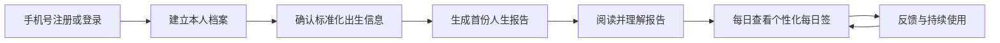

R1 的目标是验证“建档—正式报告—每日陪伴”的持续价值闭环，而不是一次性上线全部命理能力。

### 3.2 R1 功能范围

#### C 端 H5

- 手机号验证码注册与登录；
- 用户协议、隐私政策和 AI 内容说明确认；
- 本人出生档案创建、确认和修改；
- 公历/农历输入、出生城市、时间精度和真太阳时确认；
- 首份免费人生报告生成；
- 报告生成状态展示；
- 当前及历史人生报告查看；
- 个性化每日签生成与查看；
- 对报告和每日签进行轻量反馈；
- 个人设置、生活时区设置和账号注销入口。

#### Satori 运营后台

- 用户、档案和报告查询；
- 生成任务状态和失败原因查询；
- 失败任务的受控重试；
- 权益发放、预占、核销和补偿记录查询；
- AI 运行标识、工作流版本和成本摘要查询；
- 用户反馈查询；
- 配置、Feature Flag 和审计日志查询；
- 敏感数据按角色脱敏。

### 3.3 R1 明确不包含

- 卡牌抽取和卡牌解读；
- 关系报告；
- 流年、阶段或周期专项报告；
- AI 陪伴聊天；
- 多人档案管理；
- 公开报告链接和公开分享访问；
- 商品、订单、支付、退款和对账；
- 多品牌、多组织和多租户；
- 完整内容管理系统；
- 通过问答反推出生时辰。

---

## 4. 架构原则

### 4.1 用户拥有选择权

系统表达倾向、模式和可能性，不把 AI 输出包装成不可改变的命运结论。出生资料不完整时应缩小结论范围，不由模型猜测缺失事实。

### 4.2 业务事实与 AI 表达分离

Satori 负责标准化出生信息和计算排盘事实；Aqua AI 只能解释明确提供的事实，不负责自行排盘或修改业务事实。

### 4.3 最终业务数据归 Satori

用户、档案、排盘快照、权益、最终报告和每日签的业务事实由 Satori 保存。Aqua 保存工作流运行所需的技术状态，不成为产品数据的事实来源。

### 4.4 历史可复现

档案、排盘算法、报告 Schema、Aqua Workflow、知识库、Prompt 和模型信息均需版本化。历史报告不会因用户修改档案或升级算法而变化。

### 4.5 异步优先与幂等

人生报告属于耗时、可失败、可重试的异步任务。创建任务、权益核销、Aqua 调用和结果落库都必须支持幂等。

### 4.6 模块化单体优先

R1 在一个 Satori Backend 代码库内保持清晰领域边界，API 和 Worker 独立部署。仅在真实容量、团队或隔离需求出现后拆分服务。

### 4.7 为 R2 预留能力，不提前实现 R2

R1 建立可复用的报告、生成任务、权益、AI 集成和上下文授权基础设施；不在 R1 数据模型中加入未使用的卡牌业务字段。

---

## 5. 系统上下文

```mermaid
flowchart LR
    USER["C 端用户"]
    OPERATOR["运营与客服"]
    SMS["短信服务商"]
    GEO["地点与时区数据服务"]
    MODEL["模型服务"]
    KB["知识库 / MCP / RAG"]

    subgraph SATORI["Satori 产品系统"]
        H5["Satori H5"]
        ADMIN["Satori Admin"]
        BACKEND["Satori Backend"]
    end

    AQUA["Aqua AI 工作流系统"]

    USER --> H5
    OPERATOR --> ADMIN
    H5 --> BACKEND
    ADMIN --> BACKEND
    BACKEND --> SMS
    BACKEND --> GEO
    BACKEND --> AQUA
    AQUA --> MODEL
    AQUA --> KB
```

### 5.1 系统边界

| 系统 | 负责 | 不负责 |
| --- | --- | --- |
| Satori H5 | 用户交互、表单展示、报告渲染、任务进度展示 | 排盘、权益判断、Prompt 拼装、直接调用 Aqua |
| Satori Backend | 身份、档案、排盘、权益、报告生命周期、每日签、授权、安全、最终数据 | 模型编排和知识检索实现 |
| Satori Admin | 运营查询、任务处理、权益调整、审计查看 | 绕过 Backend 直接修改数据库 |
| Aqua AI | Workflow、知识检索、模型调用、结构化内容生成、技术计量 | Satori 登录、产品权益、最终报告归档 |
| 外部模型/知识系统 | 模型推理和知识提供 | 直接访问 Satori 用户数据 |

---

## 6. 容器与部署架构

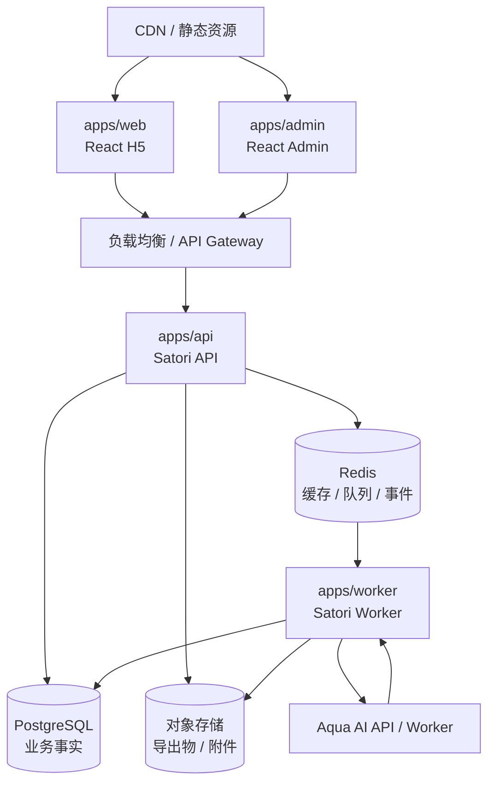

### 6.1 部署单元

| 部署单元 | 主要职责 | 扩缩容依据 |
| --- | --- | --- |
| `web` | H5 静态资源和前端应用 | CDN 流量 |
| `admin` | 运营后台前端 | 运营访问量 |
| `api` | REST API、鉴权、查询、命令接收、SSE | HTTP 并发与 SSE 连接数 |
| `worker` | 排盘后的异步编排、Aqua 调用、校验、通知、删除任务 | 队列积压与生成并发 |
| PostgreSQL | 业务事实、事务和版本关系 | 数据量、连接和查询负载 |
| Redis | 缓存、验证码、限流、BullMQ、任务事件 | 队列与实时事件负载 |
| 对象存储 | 报告导出物和附件 | 文件量与下载流量 |
| Aqua AI | AI 工作流和知识检索 | 模型并发与工作流耗时 |

### 6.2 推荐技术基线

以下是 R1 推荐基线，允许在进入工程设计时做等价替换：

- H5：React + TypeScript + Vite；
- Admin：React + TypeScript；
- Backend：NestJS + TypeScript；
- 数据库：PostgreSQL；
- ORM：Prisma 或 Drizzle，工程设计阶段二选一；
- Redis 客户端与任务队列：Redis + BullMQ；
- 对象存储：S3 兼容服务；
- 外部接口：REST/JSON；
- 任务进度：SSE，轮询作为降级方案；
- 输入输出校验：JSON Schema 或 Zod；
- 可观测性：结构化日志、Trace ID、Metrics、错误监控；
- 交付：Docker 容器化。

R1 不引入 gRPC、Kafka、服务网格和 Kubernetes 强依赖。

---

## 7. Satori Backend 模块架构

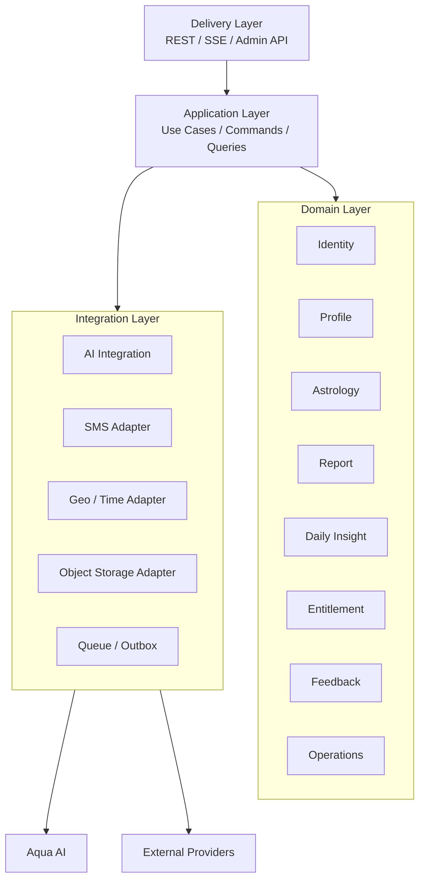

### 7.1 Identity 模块

负责：

- 手机号验证码发送和校验；
- 用户注册、登录、刷新和退出；
- 登录身份与用户主体分离；
- Session 管理；
- 用户协议和隐私授权记录；
- 账号状态和注销流程入口；
- 登录风险控制。

手机号只存在于身份模块。业务模块通过 `user_id` 引用用户，不复制手机号。

### 7.2 Profile 模块

负责：

- 本人 Subject；
- LifeProfile 逻辑档案；
- 不可变 LifeProfileRevision；
- 原始公历/农历输入；
- 出生时间精度；
- 出生城市及解析快照；
- 钟表时间、时区、真太阳时；
- 用户确认状态；
- 当前有效版本切换。

R1 在应用层约束一个用户只能创建一个 `SELF` 类型 Subject。数据库模型不把 User 与 Profile 合并，为未来多人和关系能力保留空间。

### 7.3 Astrology 模块

负责：

- 出生输入标准化；
- 历法转换；
- 时区和真太阳时计算；
- 排盘计算；
- 确定事实与不确定事实标记；
- AstrologySnapshot 持久化；
- 算法和计算策略版本记录。

Astrology 模块只输出结构化领域事实，不生成用户可见的大段解释文案。

### 7.4 Report 模块

负责：

- Report 逻辑对象；
- ReportRevision 不可变版本；
- Report Schema 版本；
- 报告生成任务和状态机；
- 报告发布、历史查询和失效提示；
- GenerationManifest；
- 结构化内容校验；
- 报告访问控制。

### 7.5 Daily Insight 模块

负责：

- 用户当地日期解析；
- 当日历法上下文；
- 每日签唯一性；
- 按需生成、缓存和兜底；
- 当日内容稳定性；
- 每日签历史和反馈。

### 7.6 Entitlement 模块

负责：

- 新用户免费权益发放；
- 权益账本；
- 生成前预占；
- 成功核销；
- 失败释放或补偿；
- 人工调整和审计。

R1 不接支付，但所有报告生成仍通过权益账本。Aqua 的 Token 或资源点不能直接充当 Satori 用户权益。

### 7.7 AI Integration 模块

负责：

- Aqua Client；
- Satori 报告类型到 Aqua Workflow 的版本绑定；
- AIContextGrant；
- AIRunBinding；
- 幂等键；
- Aqua 事件映射；
- 输出 Schema、安全性和事实引用校验；
- 技术成本摘要接收；
- Aqua 不可用时的熔断和重试。

### 7.8 Operations 模块

负责：

- 后台角色与权限；
- 审计日志；
- Feature Flag；
- 系统配置版本；
- 任务重试授权；
- 用户反馈和敏感内容处理；
- 运行健康状态。

---

## 8. 核心领域模型

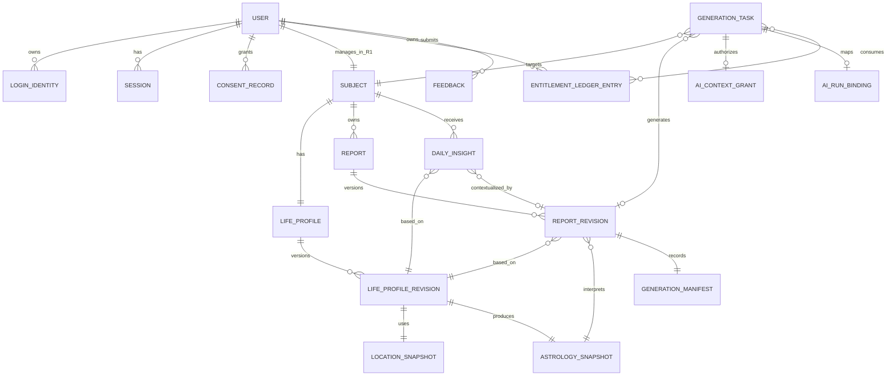

### 8.1 核心对象说明

| 对象 | 说明 | 可变性 |
| --- | --- | --- |
| User | 产品账号 | 状态可变 |
| LoginIdentity | 手机号等登录身份 | 可绑定、停用 |
| Subject | 被解读的自然人；R1 固定为本人 | 基本稳定 |
| LifeProfile | 逻辑档案和当前版本指针 | 指针可变 |
| LifeProfileRevision | 一次用户确认后的完整出生资料 | 不可变 |
| LocationSnapshot | 当时使用的城市、经纬度、时区数据 | 不可变 |
| AstrologySnapshot | 某档案版本和算法版本产生的排盘事实 | 不可变 |
| Report | 某主体某类报告的逻辑容器 | 状态可变 |
| ReportRevision | 一次正式生成的报告内容 | 发布后不可变 |
| GenerationTask | 一次异步生成过程 | 按状态机变化 |
| GenerationManifest | 生成所用工作流、知识、模型和输入摘要 | 不可变 |
| DailyInsight | 某主体在某生活时区日期的每日签 | 发布后不可变 |
| EntitlementLedgerEntry | 权益变动流水 | 只追加 |
| AIContextGrant | 一次 AI 运行允许使用的数据范围 | 到期后失效 |
| AIRunBinding | Satori Task 与 Aqua Run 的映射 | 状态可变 |

### 8.2 档案版本关系

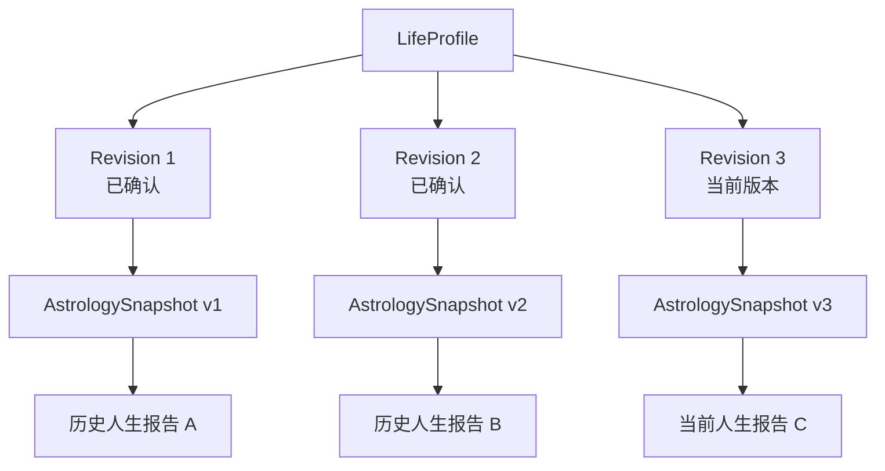

档案修改不是 UPDATE 原记录，而是创建新的 Revision。旧的 AstrologySnapshot、ReportRevision 和 DailyInsight 不重算。

---

## 9. 关键状态机

### 9.1 档案版本状态

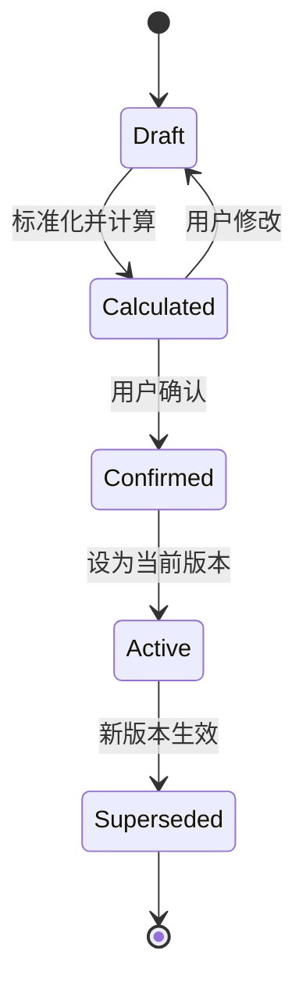

只有 `Active` 且已生成 AstrologySnapshot 的档案版本可以发起正式报告。

### 9.2 报告生成任务状态

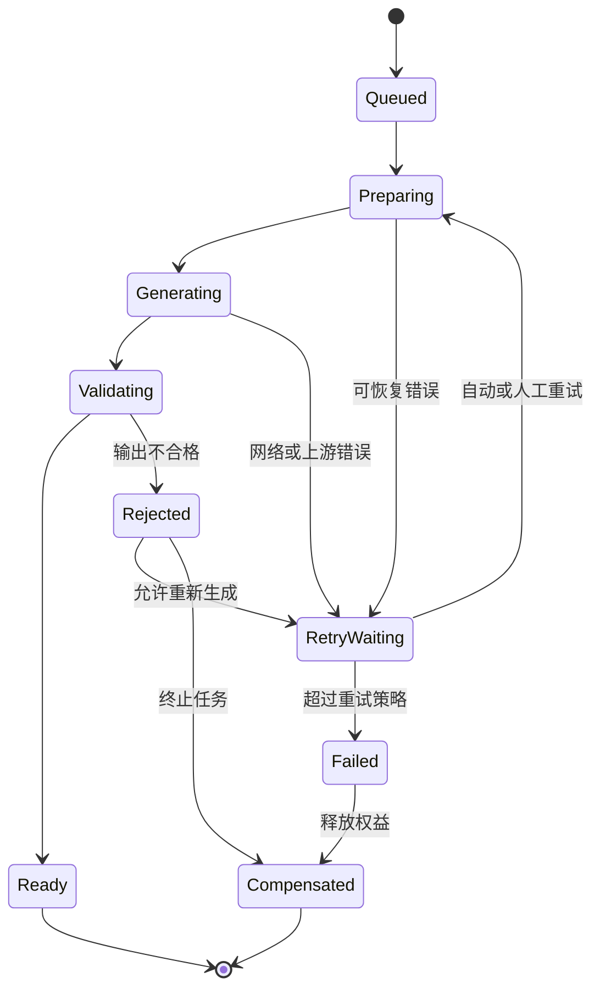

对外状态可以收敛为 `PENDING`、`GENERATING`、`READY`、`FAILED`，内部保留详细状态。

### 9.3 报告发布状态

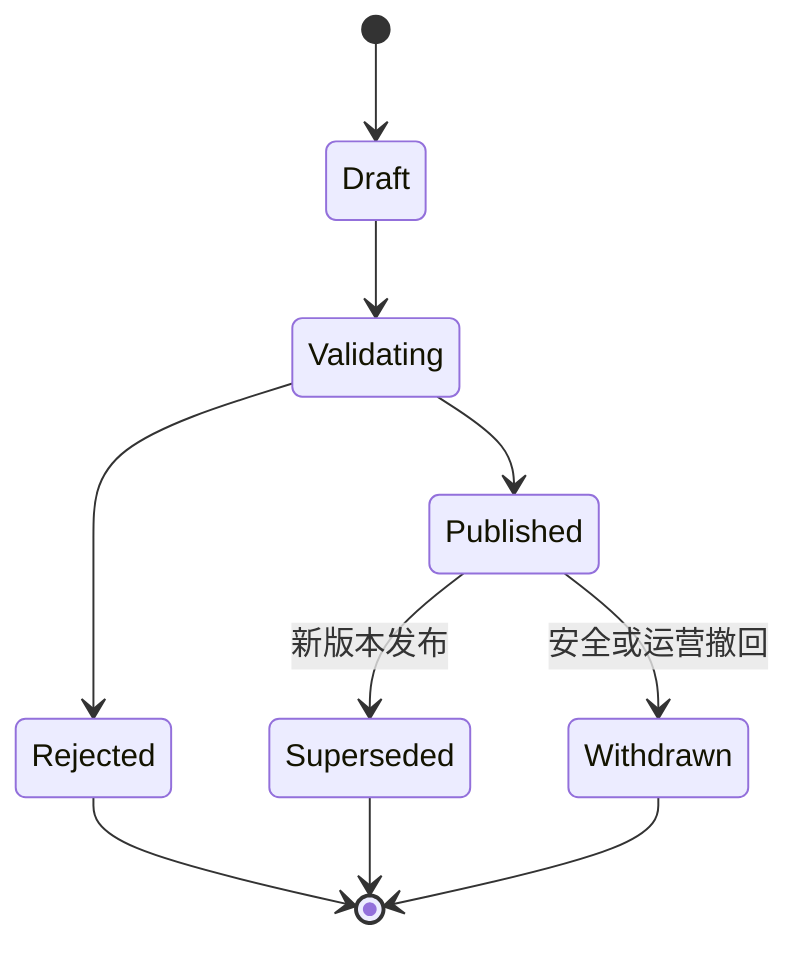

报告只在完整验证通过后原子发布，H5 不展示半成品章节。

---

## 10. 关键业务流程

### 10.1 手机号登录

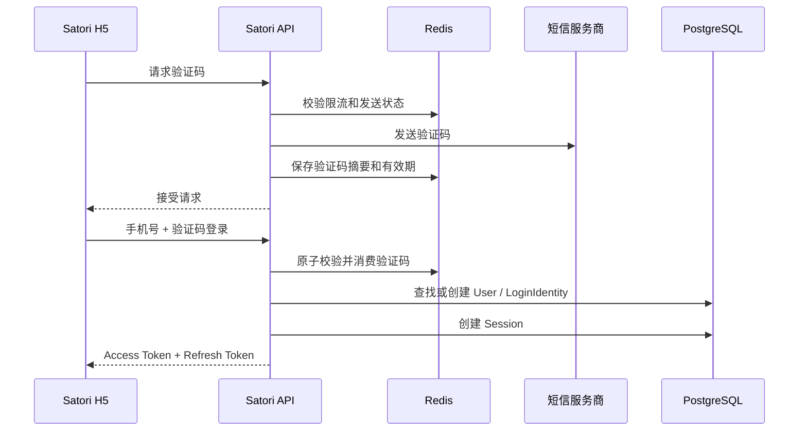

验证码本身不明文持久化。发送、校验、登录和刷新接口分别限流。

### 10.2 档案创建与确认

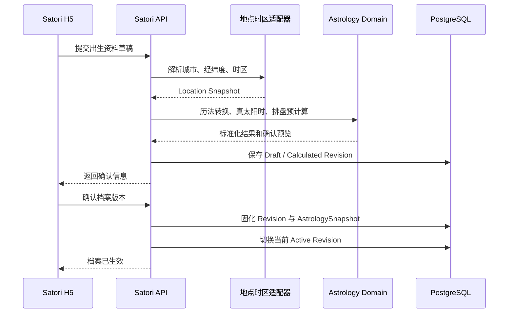

如果真太阳时造成日期或时辰变化，确认结果必须明确标记，但具体 UI 文案不属于本文档范围。

### 10.3 人生报告生成

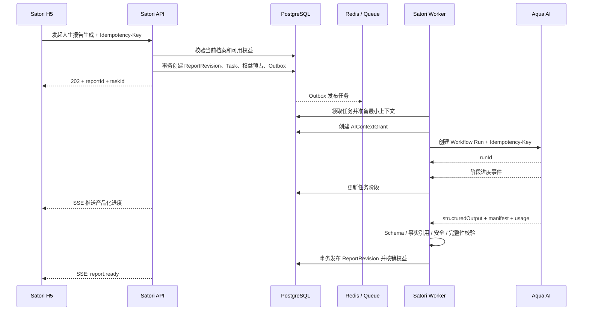

如果 Aqua 返回成功但网络响应丢失，Worker 使用同一幂等键查询原 Run，不创建第二次运行。

### 10.4 每日签按需生成

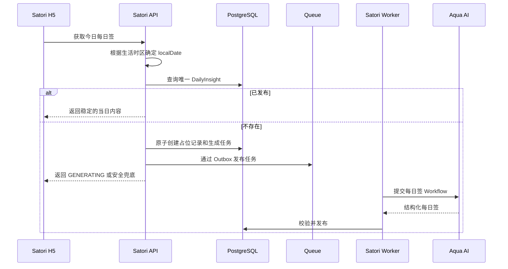

每日签唯一键建议包含 `subject_id + local_date + timezone_id + content_policy_version`。当天生成后，档案或时区变化不修改已有内容。

---

## 11. Satori 与 Aqua AI 集成

### 11.1 集成边界

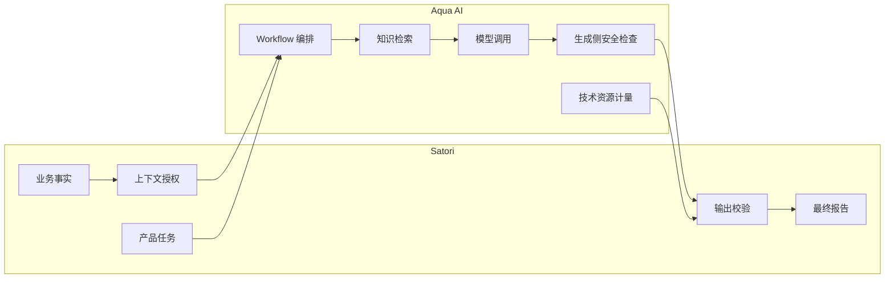

### 11.2 AIContextGrant

每次 AI 运行由 Satori 创建一次用途明确的上下文授权，至少描述：

- 允许执行的 Workflow 和版本范围；
- 对应的 opaque subject ID；
- 允许使用的数据字段或上下文快照；
- 使用目的；
- 有效期；
- 数据敏感等级；
- 请求关联的 Satori task ID。

Satori 不向 Aqua 发送手机号、登录身份或与生成无关的个人信息。

### 11.3 Aqua 需要提供的正式能力

Aqua 当前能力需要收敛为正式的 Workflow Run 契约：

- 创建运行：接受工作流版本、结构化输入、输出 Schema、上下文授权和幂等键；
- 查询运行：返回持久化状态，不能只依赖当前 SSE 连接；
- 运行事件：提供阶段级事件流；
- 查询结果：返回结构化结果、Manifest、Usage 和 Warnings；
- 取消或终止：在工作流允许时终止未完成运行；
- 删除数据：根据 opaque subject ID 或 run ID 删除关联技术数据；
- 服务鉴权：仅允许受信任的 Satori 服务身份调用。

具体 URL、字段和错误码在《Satori Backend 与 Aqua AI 接口文档》中定义。

### 11.4 GenerationManifest

正式报告至少记录：

- Satori report schema 版本；
- Satori profile revision ID；
- AstrologySnapshot ID 和算法版本；
- Aqua workflow ID 和版本；
- 知识库版本；
- Prompt/策略版本；
- 模型标识；
- 输入摘要 Hash；
- 输出 Schema 版本；
- 安全策略版本；
- Aqua run ID；
- 生成时间；
- 技术使用量摘要；
- 警告和降级信息。

Manifest 用于内部追溯，不将全部技术细节直接展示给用户。

### 11.5 报告输出契约

Aqua 返回结构化 JSON，不直接决定 H5 页面 HTML。逻辑结构示例：

```json
{
  "schemaVersion": "life-report/1.0",
  "summary": {
    "title": "...",
    "keywords": [],
    "overview": "..."
  },
  "sections": [
    {
      "sectionCode": "STRENGTHS",
      "title": "...",
      "summary": "...",
      "insights": [],
      "actions": [],
      "evidenceRefs": [],
      "uncertainty": {
        "level": "LOW",
        "reason": null
      }
    }
  ],
  "warnings": []
}
```

具体章节、长度和文案规范由报告产品设计补充；结构必须通过版本化 Schema 管理。

---

## 12. 数据所有权与一致性

### 12.1 数据所有权矩阵

| 数据 | 主数据系统 | Aqua 是否持久化 |
| --- | --- | --- |
| 用户账号、手机号、Session | Satori | 否 |
| 用户协议和授权记录 | Satori | 否 |
| 出生原始输入和档案版本 | Satori | 仅接收必要运行输入 |
| 排盘事实和算法版本 | Satori | 可在运行期间引用 |
| 产品权益和流水 | Satori | 否 |
| Workflow 定义和执行状态 | Aqua | 是 |
| 知识库和检索结果 | Aqua | 是 |
| 模型 Token/技术成本 | Aqua | 是，并向 Satori 返回摘要 |
| 最终人生报告 | Satori | 可短期保留运行输出，不作为主数据 |
| 最终每日签 | Satori | 可短期保留运行输出，不作为主数据 |
| GenerationManifest | Satori 保存正式副本 | Aqua 保存技术原件 |

### 12.2 事务与 Outbox

创建生成任务时，以下写入必须在同一数据库事务内完成：

- 创建或定位 Report；
- 创建 Draft ReportRevision；
- 创建 GenerationTask；
- 创建权益预占流水；
- 创建 OutboxEvent。

独立 Outbox Publisher 将事件投递至队列。这样即使 API 在事务提交后崩溃，任务也不会永久丢失。

### 12.3 幂等边界

| 场景 | 幂等依据 |
| --- | --- |
| H5 发起报告 | `user_id + Idempotency-Key` |
| 创建每日签 | 数据库业务唯一键 |
| Worker 调用 Aqua | `generation_task_id + attempt_generation` |
| Aqua 返回结果 | `aqua_run_id + output_version` |
| 权益核销/补偿 | `generation_task_id + ledger_action` |
| 管理员重试 | 原 task 派生 attempt，不创建重复报告 |

---

## 13. 鉴权与访问控制

### 13.1 C 端鉴权

- Access Token 使用短有效期；
- Refresh Token 绑定 Session，可单独吊销；
- Refresh Token 轮换并检测重复使用；
- H5 只能访问当前登录用户拥有的 Subject、Report 和 DailyInsight；
- 对象存储资源通过 Backend 授权或短期签名 URL 访问；
- 报告不存在公开匿名访问路径。

### 13.2 管理后台鉴权

- 管理员身份与 C 端用户身份分离；
- 使用 RBAC；
- 用户敏感信息默认脱敏；
- 权益调整、任务重试、报告撤回等操作记录审计日志；
- 高风险操作可在工程设计阶段增加二次确认或双人复核。

### 13.3 服务间鉴权

Satori 与 Aqua 使用独立服务身份。推荐采用 HTTPS + 短期签名 Token 或 mTLS，至少保证：

- 请求来源可验证；
- 请求不可重放；
- 每次请求携带 Trace ID 和幂等键；
- Aqua 无法利用服务身份调用 Satori 的用户接口。

---

## 14. 安全与隐私基线

### 14.1 数据分类

| 等级 | 示例 | 处理要求 |
| --- | --- | --- |
| 高敏感 | 手机号、精确出生时间和地点 | 加密、脱敏、最小访问、审计 |
| 敏感 | 排盘快照、报告、用户自由文本反馈 | 权限隔离、日志脱敏 |
| 内部 | Workflow 版本、成本、任务状态 | 后台授权访问 |
| 公开配置 | 协议版本、客户端功能开关 | 可缓存但需防篡改 |

### 14.2 安全规则

- 日志不输出验证码、Token、手机号明文和完整出生资料；
- 生产环境 Prompt/Response 日志默认脱敏；
- H5 不保存长期 Token 到不安全的可读存储；
- 数据库备份加密并定期验证恢复；
- Aqua 只接收最小必要上下文；
- 医疗、投资、灾祸、自伤等高风险表达进入独立安全检查；
- 输出安全检查在 Aqua 生成侧和 Satori 发布侧各执行一次；
- 数据删除采用可追踪异步任务，具体保留期限后续配置。

---

## 15. 可靠性与降级

### 15.1 依赖故障处理

| 故障 | 用户体验 | 系统处理 |
| --- | --- | --- |
| 短信服务故障 | 提示稍后重试 | 熔断、供应商错误归一化 |
| 地点解析失败 | 用户选择标准城市或人工修正 | 不生成未经确认的排盘 |
| Aqua 暂时不可用 | 报告保持生成中或进入重试 | 指数退避、熔断、告警 |
| Aqua 输出不合格 | 不发布半成品 | 拒绝、受控重试、权益补偿 |
| SSE 中断 | 页面自动重连或轮询 | 服务端任务继续执行 |
| Redis 短暂故障 | 部分实时能力降级 | PostgreSQL 仍为任务事实来源 |
| 对象存储故障 | 在线结构化报告仍可阅读 | 导出物延迟生成 |

### 15.2 超时与重试原则

- HTTP 请求不等待完整人生报告生成；
- Satori 调用 Aqua 的创建请求使用较短网络超时；
- Workflow 执行超时与 HTTP 超时分离；
- 仅对可恢复错误自动重试；
- 内容安全拒绝不能进行无限自动重试；
- 所有重试复用业务幂等标识；
- 超过最大重试后释放或补偿产品权益。

---

## 16. 可观测性

### 16.1 统一关联标识

一次报告生成应能通过以下标识串联：

```text
trace_id
 request_id
 generation_task_id
 report_revision_id
 aqua_run_id
 opaque_subject_id
 idempotency_key
```

### 16.2 关键指标

- 注册及验证码成功率；
- 档案创建和确认转化率；
- 报告任务排队时长；
- 报告生成成功率、P50/P95/P99 耗时；
- Aqua 各 Workflow 版本成功率；
- 输出 Schema 和安全校验拒绝率；
- 权益预占未释放数量；
- 每日签生成成功率和兜底率；
- SSE 在线连接和重连率；
- 单报告技术资源成本；
- 不同报告版本的用户反馈分布。

### 16.3 告警

至少覆盖：

- 报告失败率突增；
- 队列积压超过阈值；
- 任务长时间停留在中间状态；
- 权益预占与任务状态不一致；
- Aqua、短信或数据库不可用；
- 安全拒绝率异常；
- 数据删除任务长期失败。

---

## 17. 配置与版本管理

以下配置不得以散落的环境变量或代码常量作为唯一来源：

- 报告类型与 Aqua Workflow 版本绑定；
- 报告输出 Schema 版本；
- 排盘算法和计算策略版本；
- 知识库版本；
- 安全策略版本；
- 每日签内容策略版本；
- 免费权益发放规则；
- 功能开关和灰度范围。

配置变更需要：

- 版本号；
- 生效时间；
- 修改人；
- 变更说明；
- 回滚能力；
- 审计记录。

正式生成任务在创建时固化所使用的版本，避免运行过程中配置变化。

---

## 18. R2 卡牌解读扩展

### 18.1 R2 新增领域对象

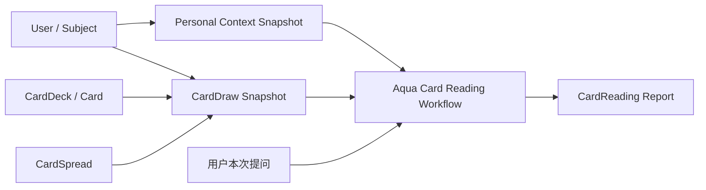

R2 独立增加：

- CardDeck；
- Card；
- CardSpread；
- CardDraw；
- CardDrawItem；
- CardReading。

卡牌抽取结果先由 Satori 固化为不可变 CardDraw Snapshot，再交给 Aqua 解读。Aqua 不负责随机抽卡，避免重试导致抽取结果变化。

### 18.2 R1 可复用能力

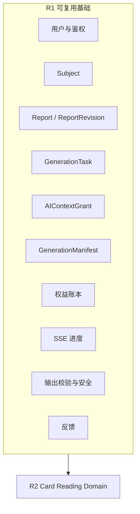

### 18.3 报告类型扩展

统一报告基础设施可支持：

```text
LIFE_REPORT
CARD_READING
PERIOD_REPORT
RELATIONSHIP_REPORT
GROWTH_SUMMARY
```

每种报告拥有独立的来源快照、Workflow 和输出 Schema。不得通过在同一张表上增加大量可空业务字段来支持新报告类型。

### 18.4 Personal Context Snapshot

R1 可以在正式人生报告发布后派生一份内部结构化上下文，供每日签和 R2 使用。它只包含经过授权的稳定主题、成长方向、不确定性和事实引用，不包含手机号等身份信息。

该快照不是业务事实，不反向修改档案或排盘；每次生成必须绑定来源 ReportRevision 和 Schema 版本。

---

## 19. 推荐代码组织

```text
satori/
├── apps/
│   ├── web/                    # C 端 H5
│   ├── admin/                  # 运营后台
│   ├── api/                    # REST、SSE、鉴权和应用服务入口
│   └── worker/                 # 异步任务和 Aqua 调用
├── packages/
│   ├── domain/                 # 领域对象、规则和状态机
│   ├── application/            # Commands、Queries、Use Cases
│   ├── contracts/              # API DTO、事件和 Schema
│   ├── infrastructure/         # DB、Redis、对象存储和外部适配器
│   ├── astrology-engine/       # 历法、真太阳时和排盘计算
│   ├── observability/          # 日志、Tracing 和 Metrics
│   └── shared/                 # 少量无领域语义的公共能力
├── docs/
│   ├── architecture/
│   ├── api/
│   └── adr/
└── deploy/
```

模块间通过应用服务和明确契约协作，不允许 Controller 直接访问 ORM Model，也不允许领域模块直接调用 Aqua SDK。

---

## 20. 环境与发布策略

建议至少设置：

- Local：开发环境，可使用模拟短信和 Aqua Stub；
- Test：自动化测试和接口契约验证；
- Staging：接近生产的集成验证环境；
- Production：生产环境。

关键要求：

- 不同环境使用独立数据库、Redis、对象存储和 Aqua 配置；
- 数据库迁移由独立发布步骤执行；
- API 与 Worker 支持分别回滚；
- Workflow、Schema 和知识库版本先在 Staging 验证；
- 新报告版本通过 Feature Flag 灰度；
- 旧 ReportRevision 始终使用原版本解释，不因部署回滚而改变。

---

## 21. 测试策略

### 21.1 领域测试

- 公历/农历转换；
- 时区、经纬度和真太阳时；
- 出生时间不确定性；
- 档案不可变版本；
- 报告状态机；
- 权益预占、核销和补偿；
- 每日签业务唯一性。

### 21.2 契约测试

- H5 与 Satori API Schema；
- Satori 与 Aqua Workflow Run Schema；
- SSE 事件兼容性；
- 报告 JSON Schema；
- GenerationManifest Schema；
- 外部短信和地点服务适配器。

### 21.3 集成与故障测试

- Aqua 超时、重复响应和中途断连；
- Worker 崩溃后任务恢复；
- Outbox 重复投递；
- SSE 断线重连；
- 同一用户重复点击生成；
- 同日多设备并发生成每日签；
- 报告发布成功但通知失败；
- 权益账务对账。

### 21.4 内容质量测试

- 固定输入集的回归评测；
- 章节完整性；
- 事实引用有效性；
- 不确定出生时间下的越界表达；
- 医疗、财富、灾祸等风险表达；
- Workflow 或知识库升级前后差异评估。

---

## 22. 主要架构风险

| 风险 | 影响 | 架构应对 |
| --- | --- | --- |
| 需求文档包含远期能力，容易扩大 R1 | 延期和模块污染 | 以第 3 章范围为 R1 边界 |
| 排盘规则升级改变结果 | 历史不可解释 | 档案、策略和 AstrologySnapshot 全部版本化 |
| Aqua 当前偏会话工作流，正式报告契约不足 | 集成不稳定 | 增加持久 Workflow Run、状态查询和结构化输出契约 |
| AI 返回自由文本或结构漂移 | H5 难以稳定呈现 | 固定 JSON Schema，Satori 二次校验后发布 |
| API 与队列双写不一致 | 任务丢失或权益悬挂 | PostgreSQL 事务 + Outbox |
| 用户重复提交或网络重试 | 重复生成和重复核销 | 全链路幂等键与业务唯一约束 |
| 把 Aqua 成本当用户权益 | 产品账务难以演进 | 产品权益与技术计量双账分离 |
| 为 R2 提前加入大量字段 | R1 复杂化 | 复用基础设施，R2 新建 Card Reading Domain |
| 敏感输入进入完整日志 | 隐私风险 | 最小上下文、日志脱敏和独立授权 |

---

## 23. 暂缓但不阻塞架构的产品参数

以下内容进入产品规则或接口默认值设计阶段，不需要在本架构方案中锁死：

- 短信验证码有效期和各维度限流数字；
- 档案修改后免费重生成的次数与周期；
- 人生报告的最终章节名称、字数和文案风格；
- 每日签的字段文案和历史可见天数；
- 用户反馈的选项和自由文本长度；
- Aqua 技术日志的具体保留期限；
- 账号注销冷静期；
- 是否提供脱敏分享图片；
- Prisma 与 Drizzle 的最终选择；
- H5 Token 的最终存储和刷新实现细节。

这些参数应当可配置或通过后续 ADR 确认，不改变本文定义的系统边界。

---

## 24. 下一阶段：接口文档拆分

架构方案确认后，接口设计建议拆成三份文档：

### 24.1 H5 与 Satori Backend API

覆盖：

- 通用协议、鉴权、分页、错误码、幂等；
- 手机验证码、登录、刷新和退出；
- 本人档案草稿、计算预览、确认和版本历史；
- 人生报告创建、状态、列表和详情；
- 每日签获取和状态；
- 用户反馈、用户设置和账号操作；
- SSE 连接、事件类型、断线恢复和轮询降级。

### 24.2 Admin 与 Satori Backend API

覆盖：

- 管理员鉴权与权限；
- 用户、档案、报告和任务查询；
- 任务重试、报告撤回和权益调整；
- 反馈、安全告警和审计日志。

### 24.3 Satori Backend 与 Aqua AI API

覆盖：

- 服务身份鉴权；
- Workflow Run 创建、查询、事件、结果和取消；
- 输入 Context Envelope；
- 结构化报告 Schema；
- GenerationManifest；
- 幂等、超时、重试和错误分类；
- 数据删除协议。

接口文档应从本文的领域对象和状态机推导，避免按页面临时拼装接口。

---

## 25. R1 架构完成标准

进入开发前，架构层面应满足：

- R1 范围和排除项获得确认；
- H5、Satori Backend、Aqua AI 的数据与职责边界明确；
- 档案、排盘、报告和每日签的版本关系明确；
- 报告异步状态机和权益事务边界明确；
- Aqua 正式 Workflow Run 契约可设计和实现；
- R2 卡牌解读能够复用 R1 基础设施而无需修改核心模型；
- 三类接口文档具备稳定的领域基础；
- 未确定的产品参数不会阻塞接口 Schema 和核心开发。

