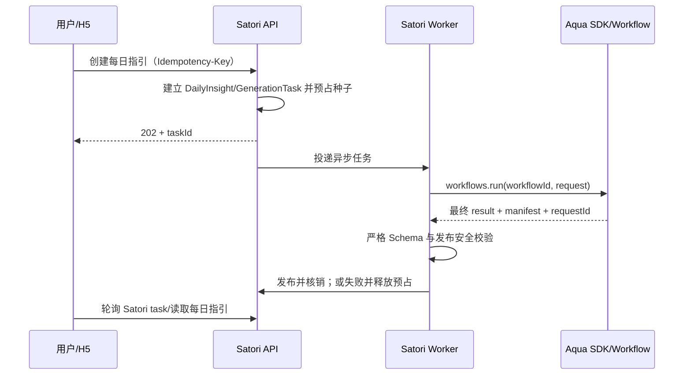

# Aqua 每日指引集成说明与联调验收

**文档状态：** Satori 适配器已实现，Aqua Staging 待端到端验收

**适用版本：** Satori R1.0

**事实核验日期：** 2026-08-26

**代码基线：** `29ec485 feat(daily-insight): integrate Aqua AI workflow`

**对接方：** Satori Backend/Worker 与 Aqua AI

## 1. 当前结论

Satori 已完成 Aqua 每日指引的代码接入，不再处于“适配器待实现”阶段：

- 后端通过 `@aqua-ai/sdk@0.1.1` 的 service-key 客户端调用无状态工作流；
- `AquaDailyInsightGenerator` 已实现输入转换、幂等键、工作流版本选择、严格输出校验、错误分类和生成清单映射；
- 运行服务固定注入 `AquaDailyInsightGenerator`，不存在 Stub/Aqua 环境切换；
- H5 只调用 Satori `/api/v1/daily-insights*`，不接触 Aqua 地址、凭据、request ID 或内部错误；
- Satori 现有异步任务、智慧种子预占/核销/释放、内容归档和前端轮询机制保持不变。

当前尚未发现测试环境启用 `AQUA` 后的真实端到端验收记录。因此只能宣称“代码已实现并通过自动化测试”，不能宣称“Aqua Staging 已联调完成”或“生产可用”。

## 2. 实际调用模型

当前 SDK 的 `workflows.run()` 是一次无状态工作流调用：Satori Worker 等待 SDK 返回最终 `WorkflowRunResponse`。旧方案中“创建持久化 Run，再由 Satori 查询状态/取消”的接口不是当前实现的一部分。



这里有两层不同的异步边界：

1. 对 H5 而言，Satori 每日指引仍是异步任务；
2. 对 Satori Worker 而言，当前 Aqua SDK 调用会等待工作流最终响应，不由 Satori 自行轮询 Aqua Run。

## 3. 代码与职责映射

| 路径                                                                                           | 当前职责                                               |
| ---------------------------------------------------------------------------------------------- | ------------------------------------------------------ |
| `backend/packages/modules/src/integrations/daily-insight/aqua-daily-insight.generator.ts`      | Aqua 输入转换、SDK 调用、响应校验、错误映射            |
| `backend/packages/modules/src/integrations/daily-insight/aqua-daily-insight.generator.spec.ts` | 输入、成功映射、活动版本、网络错误和 Schema 错误测试   |
| `backend/packages/modules/src/integrations/aqua/aqua-client.factory.ts`                        | 统一读取 Aqua 租户地址和 Service Key 并创建 SDK 客户端 |
| `backend/packages/modules/src/integrations/integrations.module.ts`                             | 注入固定 Workflow 策略和统一 Aqua 客户端               |
| `backend/packages/application/src/daily-insight/daily-insight-generator.ts`                    | Satori 生成器接口、最终内容 Schema 和发布侧安全检查    |
| `backend/packages/infrastructure/src/config/environment.ts`                                    | 环境变量校验和生产环境门禁                             |
| `backend/vendor/aqua-ai-sdk-0.1.1.tgz`                                                         | 当前锁定的 Aqua SDK 交付包                             |

职责边界保持如下：

| 职责                       | Satori                    | Aqua                     |
| -------------------------- | ------------------------- | ------------------------ |
| 用户认证、授权和数据所有权 | 负责                      | 不负责                   |
| 排盘、卡牌事实和输入固化   | 负责                      | 只解释收到的事实         |
| 工作流与模型执行           | 发起并裁决是否发布        | 负责生成                 |
| 内容安全                   | 最终 Schema/禁词/业务校验 | 生成侧校验并返回约定结构 |
| 智慧种子账务               | 预占、核销、释放/退款     | 不感知                   |
| 正式内容归档               | 保存最终内容和 manifest   | 返回技术运行结果         |

## 4. 当前 Aqua 请求契约

### 4.1 调用参数

```ts
await aqua.workflows.run(workflowId, {
  idempotencyKey: `daily-insight:${dailyInsightId}`,
  runReference: dailyInsightId,
  input,
});
```

- `workflowId` 由版本化策略固定为 `daily-insight`；
- 当前不传 `workflowVersion`，统一使用 Aqua 当前激活版本；如需锁定或回滚版本，应通过代码策略和正常发版完成，不能单独修改服务器环境变量；
- SDK 默认请求超时为 300 秒，当前 Satori 没有单独覆盖；
- SDK 对工作流调用默认不自动重试；失败后的任务重试由 Satori Worker 依据错误的 `retryable` 属性处理；
- 同一 `dailyInsightId` 始终产生相同的 Aqua 幂等键。

### 4.2 实际输入

Satori 当前发送的是经过收敛的日运事实，不发送手机号、登录 Token、真实姓名、智慧种子余额或交易流水：

```json
{
  "reportDate": "2026-08-13",
  "timezone": "Asia/Shanghai",
  "locale": "zh-CN",
  "heavenDayGanzhi": "己未",
  "season": "秋",
  "lunarMonth": 7,
  "monthCard": { "ganzhi": "丁丑" },
  "dayCard": { "ganzhi": "辛亥" }
}
```

实现会从 Satori 卡牌快照中读取 `CAREER` 维度作为 `monthCard`、`FAMILY` 维度作为 `dayCard`。缺少这些卡牌、日期非法或卡牌结构不合法时，在调用 Aqua 前以 `AQUA_AI_INPUT_INVALID` 非重试失败。

## 5. 当前 Aqua 响应契约

### 5.1 业务结果

Aqua `result` 必须严格满足：

| 字段                 | 当前约束                                                                       |
| -------------------- | ------------------------------------------------------------------------------ |
| `theme`              | 4–16 字符                                                                      |
| `insight`            | 80–800 字符                                                                    |
| `action`             | 8–200 字符                                                                     |
| `reflectionQuestion` | 8–120 字符                                                                     |
| `notice`             | 必须精确等于“本内容仅供自我觉察与日常参考，不构成医疗、心理、法律或投资建议。” |

Satori 校验通过后，会将对外内容中的 `notice` 统一映射为“内容用于自我观察与成长参考。”，再执行应用层 Schema 和禁词校验。包含“诊断、保证、必然、投资建议、医疗建议”等内容会被拒绝发布。

### 5.2 生成清单

Aqua `manifest` 必须返回以下非空字段：

```json
{
  "workflowVersion": "daily-insight/1.0.0",
  "skillName": "daily-energy-signature",
  "skillVersion": "1.0.0-aqua.1",
  "promptVersion": "daily-insight-runtime/1.0.0",
  "model": "glm-test",
  "outputSchemaVersion": "daily-insight/1.0",
  "contentPolicyVersion": "daily-insight-safe/1.0.0"
}
```

Satori 会将这些字段与 SDK 返回的 `requestId` 一并映射到正式生成清单，形成 `generator=AQUA_AI`、模型、Prompt、知识/技能、Schema、内容策略、工作流和供应方请求追踪信息。

## 6. 配置与环境门禁

| 环境变量           | 规则                                                            |
| ------------------ | --------------------------------------------------------------- |
| `AQUA_BASE_URL`    | 所有运行环境必填，必须为合法 URL；由所有 Aqua Workflow 共用     |
| `AQUA_SERVICE_KEY` | 所有运行环境必填，至少 20 字符；可调用同一租户下的全部 Workflow |

所有运行环境统一要求：

- 必须配置唯一的 Aqua Base URL 和 Service Key；每日指引与首页摘要共用同一连接工厂；
- service key 不得进入前端、Git、日志、异常正文或普通交接文档；
- 不同环境应使用独立租户凭据，并通过 Secret Manager 或等价设施轮换。

## 7. 错误、重试和账务

| 场景                    | 当前映射                                        | Satori 处理            |
| ----------------------- | ----------------------------------------------- | ---------------------- |
| SDK 返回可重试错误      | 保留 Aqua `code`、`requestId`，`retryable=true` | Worker 按任务策略重试  |
| `OUTPUT_SCHEMA_INVALID` | 当前明确标记为可重试                            | 允许重新生成           |
| SDK 其他错误            | 使用 SDK `retryable` 和错误分类                 | 可重试或终态失败       |
| Satori Zod 响应校验失败 | `AQUA_AI_RESPONSE_INVALID`、不可重试            | 拒绝发布并进入失败补偿 |
| 本地输入非法            | `AQUA_AI_INPUT_INVALID`、不可重试               | 不调用 Aqua，终态失败  |

Satori 当前队列默认：任务超时 360 秒、最多 5 次尝试、2 秒起始退避。Aqua SDK 默认请求超时 300 秒且工作流不自动重试，两者预算目前能够嵌套，但仍需在 Staging 以真实耗时验证。

只有内容通过 Aqua 响应校验和 Satori 发布校验后才核销智慧种子。最终失败必须释放预占；同一 Satori 幂等请求和同一 Aqua `idempotencyKey` 不得重复生成或重复扣种。

## 8. 已有自动化证据

截至 2026-08-13：

- Aqua 适配器单元测试覆盖 SDK 默认超时/零自动重试、输入映射、固定版本、活动版本、成功结果、网络错误和输出 Schema 错误；
- 环境配置测试覆盖统一 Aqua URL/key 缺失时的拒绝，以及合法配置的解析；
- 合并后后端 `typecheck` 通过，后端测试为 58 项通过、10 项环境相关跳过；
- 以上测试使用 mock/fake 响应，不构成真实 Aqua Staging 证明。

## 9. Staging 待验收清单

- [ ] 通过安全渠道配置测试租户 `AQUA_BASE_URL` 与 `AQUA_SERVICE_KEY`。
- [ ] 确认租户已授权 `daily-insight` 工作流，并决定固定版本还是使用当前激活版本。
- [ ] 完成一条真实 Aqua 成功生成。
- [ ] 核对输入映射、结果长度、固定 notice、manifest 全字段和 `requestId`。
- [ ] 验证同一 `dailyInsightId` 重试不会产生重复 Aqua 执行或重复扣种。
- [ ] 验证网络超时、429/5xx、非法 JSON、字段缺失、超长内容和安全拒绝。
- [ ] 验证最终失败时 GenerationTask 终态、种子释放、流水和用户错误提示一致。
- [ ] 记录真实 P50/P95、Aqua 限流、Satori 360 秒任务预算和最多 5 次尝试是否合理。
- [ ] 确认双方日志只记录必要的 request/task 标识，不泄露 service key 或敏感输入。
- [ ] 将部署版本、测试结果、已知限制和回滚方式写入发布批次记录。

## 10. 生产开启条件

只有同时满足以下条件，才允许把 Aqua 标记为生产可用：

1. Staging 成功、可重试失败、最终失败和账务补偿全部通过；
2. 工作流、技能、Prompt、模型、Schema 和内容策略版本可追溯；
3. 内容安全与黄金案例通过产品/内容验收；
4. service key 的存储、轮换、最小权限和环境隔离通过安全检查；
5. 401/402/403/429/5xx、超时、Schema 拒绝率和任务积压具备监控告警；
6. 已明确 Aqua 故障时暂停新生成、保留查询和账务补偿的操作边界；
7. 生产 Go/No-Go 有明确批准记录。

## 11. 待双方确认

1. Aqua Staging 的实际 base URL、租户授权和 service key 下发/轮换流程。
2. `daily-insight` 当前激活版本及生产是否需要在版本化代码策略中固定 Workflow 版本。
3. 真实工作流最大耗时、限流、并发、余额不足和幂等保留语义。
4. manifest 各版本字段的发布与兼容规则。
5. 输入、输出、日志和运行记录的保存期限及禁止训练/二次使用约束。
6. 当前 `CAREER → monthCard`、`FAMILY → dayCard` 映射是否为双方最终冻结语义。
7. `OUTPUT_SCHEMA_INVALID` 允许重新生成时的最大次数、成本和内容一致性预期。

## 12. 参考事实源

发生冲突时按以下顺序核验：

1. 当前分支中的适配器、配置校验和自动化测试；
2. 锁定的 `@aqua-ai/sdk@0.1.1` 类型声明与随包文档；
3. Staging 实际请求/响应和 Aqua 管理端可观测记录；
4. 本文的状态总结。

旧版文档中关于“新增适配器”“创建后轮询持久化 Aqua Run”“120 秒 Satori 任务超时”的描述已被当前实现取代，不应继续作为开发事实使用。
